# Simulated conversations on real schematics

25 distinct Adafruit board designs, six complete user/assistant turns each (150 user prompts).

**These are simulated gold/reference conversations, not model transcripts.** Answers are taken verbatim from the frozen dataset and computed from the original native schematic evidence. They do not establish model accuracy, electrical correctness, or hardware safety. Each first prompt includes the extracted evidence shown below; these examples therefore demonstrate evidence-assisted tasks, not image-only reading.

Images are unchanged copies of the corpus's circuit crops rendered from original EAGLE geometry. Adafruit attribution and source notices are retained. Original designs remain under CC BY-SA 3.0; each example links its exact source commit and license. The companion manifest records dataset, source, and image hashes.

## 1. adafruit/Adafruit-SPI-Flash-SD-Card-PCB

Conversation `real-fb719a2fcc44f305-p1` · dataset split `train` · source commit `8d985bd12f2732e94b4727e24874646f5911cd75`.

[Original schematic](https://github.com/adafruit/Adafruit-SPI-Flash-SD-Card-PCB/blob/8d985bd12f2732e94b4727e24874646f5911cd75/Adafruit%20SPI%20Flash%20SD%20Card.sch) · [CC BY-SA 3.0 license](https://github.com/adafruit/Adafruit-SPI-Flash-SD-Card-PCB/blob/8d985bd12f2732e94b4727e24874646f5911cd75/license.txt)

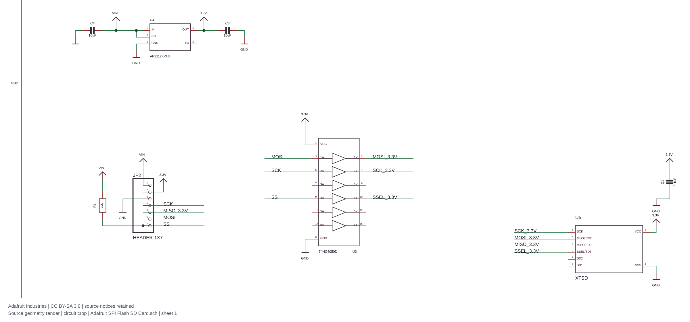

<details>
<summary>Complete system instruction and original first-turn evidence prompt</summary>

```text
You answer factual questions about the attached schematic and its extracted source evidence. Use only the supplied evidence. Identify connections as REFDES.PAD, where PAD is the physical package pad number. Distinguish schematic facts from design judgments. Do not invent missing components, specifications, measurements, or safety findings.
```

```text
Extracted native schematic evidence (not an electrical review):
{"scope": "this sheet only; physical package pad numbers, not symbol pin labels", "bom": [{"refdes": "C1", "value": "0.1uF"}, {"refdes": "C3", "value": "10uF"}, {"refdes": "C4", "value": "10uF"}, {"refdes": "FID2", "value": ""}, {"refdes": "FID3", "value": ""}, {"refdes": "JP2", "value": ""}, {"refdes": "R1", "value": "10K"}, {"refdes": "U$16", "value": ""}, {"refdes": "U$17", "value": ""}, {"refdes": "U3", "value": "74HC4050D"}, {"refdes": "U4", "value": "AP2112K-3.3"}, {"refdes": "U5", "value": "XTSD"}], "nets": {"3.3V": ["C1.1", "C3.2", "JP2.2", "U3.1", "U4.5", "U5.8"], "GND": ["C1.2", "C3.1", "C4.2", "JP2.3", "U3.8", "U4.2", "U5.4"], "MISO_3.3V": ["JP2.5", "U5.6"], "MOSI": ["JP2.6", "U3.3"], "MOSI_3.3V": ["U3.2", "U5.5"], "SCK": ["JP2.4", "U3.5"], "SCK_3.3V": ["U3.4", "U5.3"], "SS": ["JP2.7", "R1.1", "U3.9"], "SSEL_3.3V": ["U3.10", "U5.2"], "VIN": ["C4.1", "JP2.1", "R1.2", "U4.1", "U4.3"]}}

What value is recorded for R1?
```

</details>

**User 1**

```text
What value is recorded for R1?
```

**Assistant 1 — simulated gold**

```text
R1 has value 10K in the source schematic.
```

**User 2**

```text
Which physical component pads connect to net MISO_3.3V on this sheet?
```

**Assistant 2 — simulated gold**

```text
On this sheet, MISO_3.3V connects JP2.5, U5.6.
```

**User 3**

```text
Trace JP2.5: which other physical pads share its net on this sheet?
```

**Assistant 3 — simulated gold**

```text
JP2.5 is on MISO_3.3V, together with U5.6.
```

**User 4**

```text
What is the specified value of C1?
```

**Assistant 4 — simulated gold**

```text
C1 has value 0.1uF in the source schematic.
```

**User 5**

```text
What value is R9999, and what does it connect to?
```

**Assistant 5 — simulated gold**

```text
There is no R9999 in the supplied sheet evidence. Its value and connections are not shown.
```

**User 6**

```text
What measured voltage was observed at JP2.5 during a powered bench test?
```

**Assistant 6 — simulated gold**

```text
No bench measurement is supplied in this schematic or source evidence. I cannot infer a measured voltage.
```

## 2. adafruit/Adafruit-SPW2430-PCB

Conversation `real-633365f4e50f390f-p1` · dataset split `train` · source commit `929cb33e8e66308cb46321be057e7f0ad7111999`.

[Original schematic](https://github.com/adafruit/Adafruit-SPW2430-PCB/blob/929cb33e8e66308cb46321be057e7f0ad7111999/SPW2430-Silicon-Mic_Rev-B.sch) · [CC BY-SA 3.0 license](https://github.com/adafruit/Adafruit-SPW2430-PCB/blob/929cb33e8e66308cb46321be057e7f0ad7111999/license.txt)

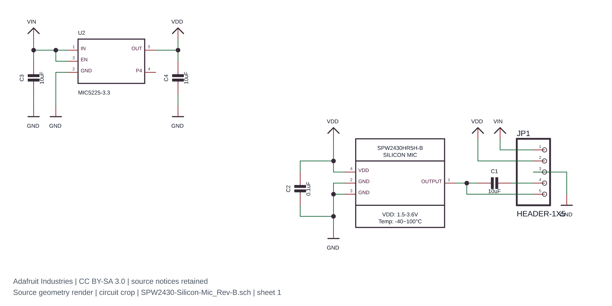

<details>
<summary>Complete system instruction and original first-turn evidence prompt</summary>

```text
You answer factual questions about the attached schematic and its extracted source evidence. Use only the supplied evidence. Identify connections as REFDES.PAD, where PAD is the physical package pad number. Distinguish schematic facts from design judgments. Do not invent missing components, specifications, measurements, or safety findings.
```

```text
Extracted native schematic evidence (not an electrical review):
{"scope": "this sheet only; physical package pad numbers, not symbol pin labels", "bom": [{"refdes": "C1", "value": "10uF"}, {"refdes": "C2", "value": "0.1uF"}, {"refdes": "C3", "value": "10uF"}, {"refdes": "C4", "value": "10uF"}, {"refdes": "FID1", "value": ""}, {"refdes": "FID2", "value": ""}, {"refdes": "JP1", "value": ""}, {"refdes": "U$12", "value": ""}, {"refdes": "U1", "value": "SPW2430HR5H-B"}, {"refdes": "U2", "value": "MIC5225-3.3"}], "nets": {"GND": ["C2.2", "C3.2", "C4.2", "JP1.3", "U1.2", "U1.3", "U2.2"], "N$1": ["C1.2", "JP1.5", "U1.1"], "N$2": ["C1.1", "JP1.4"], "VDD": ["C2.1", "C4.1", "JP1.2", "U1.4", "U2.5"], "VIN": ["C3.1", "JP1.1", "U2.1", "U2.3"]}}

What value is recorded for C1?
```

</details>

**User 1**

```text
What value is recorded for C1?
```

**Assistant 1 — simulated gold**

```text
C1 has value 10uF in the source schematic.
```

**User 2**

```text
Which physical component pads connect to net VIN on this sheet?
```

**Assistant 2 — simulated gold**

```text
On this sheet, VIN connects C3.1, JP1.1, U2.1, U2.3.
```

**User 3**

```text
Trace C3.1: which other physical pads share its net on this sheet?
```

**Assistant 3 — simulated gold**

```text
C3.1 is on VIN, together with JP1.1, U2.1, U2.3.
```

**User 4**

```text
What is the specified value of C2?
```

**Assistant 4 — simulated gold**

```text
C2 has value 0.1uF in the source schematic.
```

**User 5**

```text
What value is R9999, and what does it connect to?
```

**Assistant 5 — simulated gold**

```text
There is no R9999 in the supplied sheet evidence. Its value and connections are not shown.
```

**User 6**

```text
What measured voltage was observed at C3.1 during a powered bench test?
```

**Assistant 6 — simulated gold**

```text
No bench measurement is supplied in this schematic or source evidence. I cannot infer a measured voltage.
```

## 3. adafruit/Adafruit-ST25DV16-PCB

Conversation `real-147a74ff9f1504f6-p1` · dataset split `train` · source commit `217428893fc24414be4f14eb7e002b759bfcd0ba`.

[Original schematic](https://github.com/adafruit/Adafruit-ST25DV16-PCB/blob/217428893fc24414be4f14eb7e002b759bfcd0ba/Adafruit%20ST25DV16.sch) · [CC BY-SA 3.0 license](https://github.com/adafruit/Adafruit-ST25DV16-PCB/blob/217428893fc24414be4f14eb7e002b759bfcd0ba/license.txt)

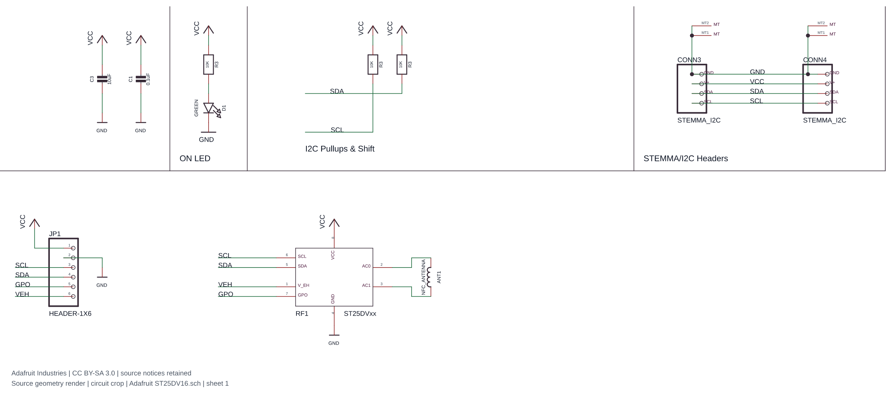

<details>
<summary>Complete system instruction and original first-turn evidence prompt</summary>

```text
You answer factual questions about the attached schematic and its extracted source evidence. Use only the supplied evidence. Identify connections as REFDES.PAD, where PAD is the physical package pad number. Distinguish schematic facts from design judgments. Do not invent missing components, specifications, measurements, or safety findings.
```

```text
Extracted native schematic evidence (not an electrical review):
{"scope": "this sheet only; physical package pad numbers, not symbol pin labels", "bom": [{"refdes": "ANT1", "value": ""}, {"refdes": "C1", "value": "0.1uF"}, {"refdes": "C3", "value": "10uF"}, {"refdes": "CONN3", "value": ""}, {"refdes": "CONN4", "value": ""}, {"refdes": "D1", "value": "GREEN"}, {"refdes": "FID3", "value": ""}, {"refdes": "FID4", "value": ""}, {"refdes": "JP1", "value": ""}, {"refdes": "R3", "value": "10K"}, {"refdes": "RF1", "value": ""}, {"refdes": "U$19", "value": ""}, {"refdes": "U$21", "value": ""}], "nets": {"GND": ["C1.2", "C3.2", "CONN3.1", "CONN3.MT1", "CONN3.MT2", "CONN4.1", "CONN4.MT1", "CONN4.MT2", "D1.C", "JP1.2", "RF1.4"], "GPO": ["JP1.5", "RF1.7"], "N$1": ["D1.A", "R3.8"], "N$2": ["ANT1.P$2", "RF1.2"], "N$3": ["ANT1.P$1", "RF1.3"], "SCL": ["CONN3.4", "CONN4.4", "JP1.3", "R3.6", "RF1.6"], "SDA": ["CONN3.3", "CONN4.3", "JP1.4", "R3.7", "RF1.5"], "VCC": ["C1.1", "C3.1", "CONN3.2", "CONN4.2", "JP1.1", "R3.1", "R3.2", "R3.3", "RF1.8"], "VEH": ["JP1.6", "RF1.1"]}}

What value is recorded for R3?
```

</details>

**User 1**

```text
What value is recorded for R3?
```

**Assistant 1 — simulated gold**

```text
R3 has value 10K in the source schematic.
```

**User 2**

```text
Which physical component pads connect to net GPO on this sheet?
```

**Assistant 2 — simulated gold**

```text
On this sheet, GPO connects JP1.5, RF1.7.
```

**User 3**

```text
Trace JP1.5: which other physical pads share its net on this sheet?
```

**Assistant 3 — simulated gold**

```text
JP1.5 is on GPO, together with RF1.7.
```

**User 4**

```text
What is the specified value of C1?
```

**Assistant 4 — simulated gold**

```text
C1 has value 0.1uF in the source schematic.
```

**User 5**

```text
What value is R9999, and what does it connect to?
```

**Assistant 5 — simulated gold**

```text
There is no R9999 in the supplied sheet evidence. Its value and connections are not shown.
```

**User 6**

```text
What measured voltage was observed at JP1.5 during a powered bench test?
```

**Assistant 6 — simulated gold**

```text
No bench measurement is supplied in this schematic or source evidence. I cannot infer a measured voltage.
```

## 4. adafruit/Adafruit-STCC4-and-SHT41-CO2-Temperature-and-Humidity-Sensor-PCB

Conversation `real-8a77897acc9dd1eb-p1` · dataset split `train` · source commit `3bf8a8ea4042964af182c617ce1ab904cc4a7bd1`.

[Original schematic](https://github.com/adafruit/Adafruit-STCC4-and-SHT41-CO2-Temperature-and-Humidity-Sensor-PCB/blob/3bf8a8ea4042964af182c617ce1ab904cc4a7bd1/Adafruit%20STCC4%20and%20SHT41%20CO2%20Temperature%20and%20Humidity%20Sensor.sch) · [CC BY-SA 3.0 license](https://github.com/adafruit/Adafruit-STCC4-and-SHT41-CO2-Temperature-and-Humidity-Sensor-PCB/blob/3bf8a8ea4042964af182c617ce1ab904cc4a7bd1/license.txt)

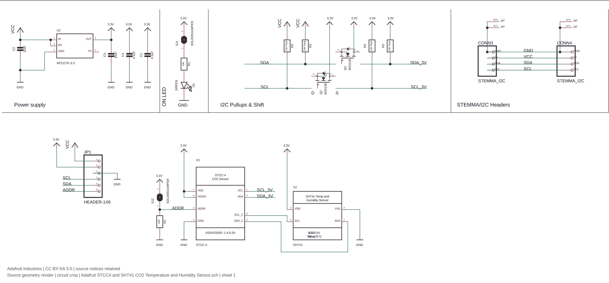

<details>
<summary>Complete system instruction and original first-turn evidence prompt</summary>

```text
You answer factual questions about the attached schematic and its extracted source evidence. Use only the supplied evidence. Identify connections as REFDES.PAD, where PAD is the physical package pad number. Distinguish schematic facts from design judgments. Do not invent missing components, specifications, measurements, or safety findings.
```

```text
Extracted native schematic evidence (not an electrical review):
{"scope": "this sheet only; physical package pad numbers, not symbol pin labels", "bom": [{"refdes": "C1", "value": "0.1uF"}, {"refdes": "C2", "value": "10uF"}, {"refdes": "C3", "value": "10uF"}, {"refdes": "C4", "value": "0.1uF"}, {"refdes": "CONN3", "value": ""}, {"refdes": "CONN4", "value": ""}, {"refdes": "D1", "value": "GREEN"}, {"refdes": "FID3", "value": "FIDUCIAL_0.5MM"}, {"refdes": "FID4", "value": "FIDUCIAL_0.5MM"}, {"refdes": "JP1", "value": ""}, {"refdes": "Q2", "value": "BSS138"}, {"refdes": "R1", "value": "10K"}, {"refdes": "R2", "value": "10K"}, {"refdes": "R3", "value": "10K Pack"}, {"refdes": "SJ1", "value": ""}, {"refdes": "SJ2", "value": ""}, {"refdes": "U$1", "value": "MOUNTINGHOLE2.5"}, {"refdes": "U$17", "value": "MOUNTINGHOLE2.5"}, {"refdes": "U$19", "value": "MOUNTINGHOLE2.5"}, {"refdes": "U$21", "value": "MOUNTINGHOLE2.5"}, {"refdes": "U2", "value": "AP2127K-3.3"}, {"refdes": "X1", "value": ""}, {"refdes": "X2", "value": "SHT41"}], "nets": {"3.3V": ["C1.1", "C3.1", "C4.1", "JP1.2", "Q2.2", "Q2.5", "R3.2", "R3.4", "SJ1.2", "SJ2.2", "U2.5", "X1.6", "X1.7", "X2.3"], "ADDR": ["JP1.6", "R2.1", "SJ2.1", "X1.3"], "GND": ["C1.2", "C2.2", "C3.2", "C4.2", "CONN3.1", "CONN3.MT1", "CONN3.MT2", "CONN4.1", "CONN4.MT1", "CONN4.MT2", "D1.C", "JP1.3", "R2.2", "U2.2", "X1.4", "X2.4"], "N$1": ["D1.A", "R1.2"], "N$2": ["R1.1", "SJ1.1"], "N$3": ["X1.8", "X2.2"], "N$4": ["X1.2", "X2.1"], "SCL": ["CONN3.4", "CONN4.4", "JP1.4", "Q2.6", "R3.8"], "SCL_3V": ["Q2.1", "R3.7", "X1.1"], "SDA": ["CONN3.3", "CONN4.3", "JP1.5", "Q2.3", "R3.6"], "SDA_3V": ["Q2.4", "R3.5", "X1.5"], "VCC": ["C2.1", "CONN3.2", "CONN4.2", "JP1.1", "R3.1", "R3.3", "U2.1", "U2.3"]}}

What value is recorded for R1?
```

</details>

**User 1**

```text
What value is recorded for R1?
```

**Assistant 1 — simulated gold**

```text
R1 has value 10K in the source schematic.
```

**User 2**

```text
Which physical component pads connect to net SCL_3V on this sheet?
```

**Assistant 2 — simulated gold**

```text
On this sheet, SCL_3V connects Q2.1, R3.7, X1.1.
```

**User 3**

```text
Trace Q2.1: which other physical pads share its net on this sheet?
```

**Assistant 3 — simulated gold**

```text
Q2.1 is on SCL_3V, together with R3.7, X1.1.
```

**User 4**

```text
What is the specified value of R2?
```

**Assistant 4 — simulated gold**

```text
R2 has value 10K in the source schematic.
```

**User 5**

```text
What value is R9999, and what does it connect to?
```

**Assistant 5 — simulated gold**

```text
There is no R9999 in the supplied sheet evidence. Its value and connections are not shown.
```

**User 6**

```text
What measured voltage was observed at Q2.1 during a powered bench test?
```

**Assistant 6 — simulated gold**

```text
No bench measurement is supplied in this schematic or source evidence. I cannot infer a measured voltage.
```

## 5. adafruit/Adafruit-STEMMA-Analog-SPDT-Switch-PCB

Conversation `real-ae79729d14af5cf7-p1` · dataset split `train` · source commit `0d377c1934aaadf3bcc8a9a89adf87b82d96726a`.

[Original schematic](https://github.com/adafruit/Adafruit-STEMMA-Analog-SPDT-Switch-PCB/blob/0d377c1934aaadf3bcc8a9a89adf87b82d96726a/Adafruit%20STEMMA%20Analog%20SPDT%20Switch.sch) · [CC BY-SA 3.0 license](https://github.com/adafruit/Adafruit-STEMMA-Analog-SPDT-Switch-PCB/blob/0d377c1934aaadf3bcc8a9a89adf87b82d96726a/license.txt)

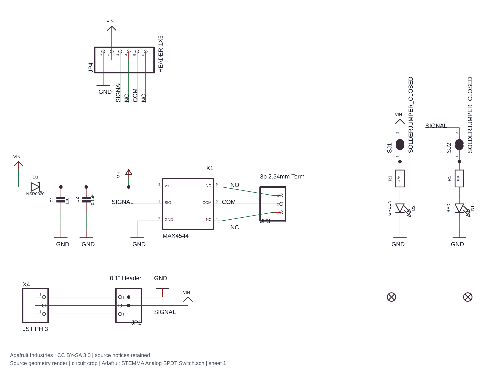

<details>
<summary>Complete system instruction and original first-turn evidence prompt</summary>

```text
You answer factual questions about the attached schematic and its extracted source evidence. Use only the supplied evidence. Identify connections as REFDES.PAD, where PAD is the physical package pad number. Distinguish schematic facts from design judgments. Do not invent missing components, specifications, measurements, or safety findings.
```

```text
Extracted native schematic evidence (not an electrical review):
{"scope": "this sheet only; physical package pad numbers, not symbol pin labels", "bom": [{"refdes": "C1", "value": "10uF"}, {"refdes": "C2", "value": "0.1uF"}, {"refdes": "D1", "value": "RED"}, {"refdes": "D2", "value": "GREEN"}, {"refdes": "D3", "value": "NSR0320"}, {"refdes": "FID2", "value": ""}, {"refdes": "FID3", "value": ""}, {"refdes": "JP1", "value": "0.1\" Header"}, {"refdes": "JP3", "value": "3p 2.54mm Term"}, {"refdes": "JP4", "value": ""}, {"refdes": "R1", "value": "10K"}, {"refdes": "R3", "value": "47K"}, {"refdes": "SJ1", "value": ""}, {"refdes": "SJ2", "value": ""}, {"refdes": "U$1", "value": ""}, {"refdes": "U$8", "value": ""}, {"refdes": "X1", "value": "MAX4544"}, {"refdes": "X4", "value": "JST PH 3"}], "nets": {"COM": ["JP3.2", "JP4.5", "X1.5"], "GND": ["C1.2", "C2.2", "D1.C", "D2.C", "JP1.3", "JP4.1", "X1.3", "X4.1"], "N$1": ["R3.2", "SJ1.1"], "N$2": ["D1.A", "R1.1"], "N$26": ["D2.A", "R3.1"], "N$3": ["R1.2", "SJ2.1"], "NC": ["JP3.1", "JP4.6", "X1.4"], "NO": ["JP3.3", "JP4.4", "X1.6"], "SIGNAL": ["JP1.1", "JP4.3", "SJ2.2", "X1.1", "X4.3"], "V+": ["C1.1", "C2.1", "D3.C", "X1.2"], "VIN": ["D3.A", "JP1.2", "JP4.2", "SJ1.2", "X4.2"]}}

What value is recorded for R1?
```

</details>

**User 1**

```text
What value is recorded for R1?
```

**Assistant 1 — simulated gold**

```text
R1 has value 10K in the source schematic.
```

**User 2**

```text
Which physical component pads connect to net COM on this sheet?
```

**Assistant 2 — simulated gold**

```text
On this sheet, COM connects JP3.2, JP4.5, X1.5.
```

**User 3**

```text
Trace JP3.2: which other physical pads share its net on this sheet?
```

**Assistant 3 — simulated gold**

```text
JP3.2 is on COM, together with JP4.5, X1.5.
```

**User 4**

```text
What is the specified value of R3?
```

**Assistant 4 — simulated gold**

```text
R3 has value 47K in the source schematic.
```

**User 5**

```text
What value is R9999, and what does it connect to?
```

**Assistant 5 — simulated gold**

```text
There is no R9999 in the supplied sheet evidence. Its value and connections are not shown.
```

**User 6**

```text
What measured voltage was observed at JP3.2 during a powered bench test?
```

**Assistant 6 — simulated gold**

```text
No bench measurement is supplied in this schematic or source evidence. I cannot infer a measured voltage.
```

## 6. adafruit/Adafruit-STEMMA-Audio-Amp-PCB

Conversation `real-2aa9670d485c0142-p1` · dataset split `val` · source commit `12d0f77a674db2b356c9e6b385f3917d4eb3420a`.

[Original schematic](https://github.com/adafruit/Adafruit-STEMMA-Audio-Amp-PCB/blob/12d0f77a674db2b356c9e6b385f3917d4eb3420a/Adafruit%20STEMMA%20Audio%20Amp.sch) · [CC BY-SA 3.0 license](https://github.com/adafruit/Adafruit-STEMMA-Audio-Amp-PCB/blob/12d0f77a674db2b356c9e6b385f3917d4eb3420a/license.txt)

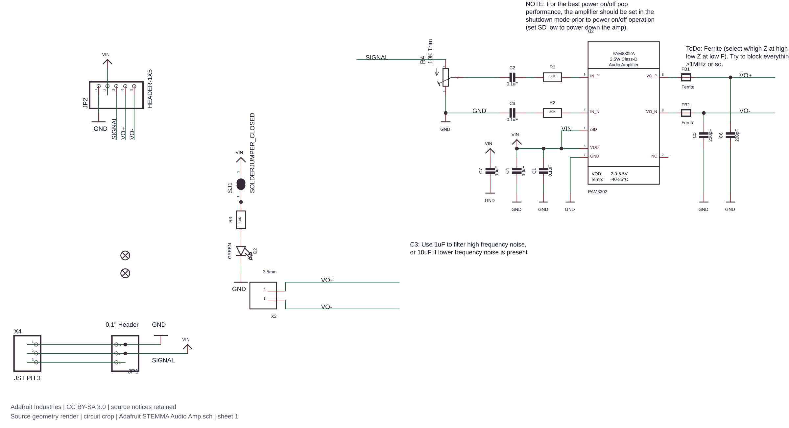

<details>
<summary>Complete system instruction and original first-turn evidence prompt</summary>

```text
You answer factual questions about the attached schematic and its extracted source evidence. Use only the supplied evidence. Identify connections as REFDES.PAD, where PAD is the physical package pad number. Distinguish schematic facts from design judgments. Do not invent missing components, specifications, measurements, or safety findings.
```

```text
Extracted native schematic evidence (not an electrical review):
{"scope": "this sheet only; physical package pad numbers, not symbol pin labels", "bom": [{"refdes": "C1", "value": "0.1uF"}, {"refdes": "C2", "value": "0.1uF"}, {"refdes": "C3", "value": "0.1uF"}, {"refdes": "C4", "value": "10uF"}, {"refdes": "C5", "value": "220pF"}, {"refdes": "C6", "value": "220pF"}, {"refdes": "C7", "value": "10uF"}, {"refdes": "D2", "value": "GREEN"}, {"refdes": "FB1", "value": "Ferrite"}, {"refdes": "FB2", "value": "Ferrite"}, {"refdes": "FID2", "value": ""}, {"refdes": "FID3", "value": ""}, {"refdes": "JP1", "value": "0.1\" Header"}, {"refdes": "JP2", "value": ""}, {"refdes": "R1", "value": "30K"}, {"refdes": "R2", "value": "30K"}, {"refdes": "R3", "value": "10K"}, {"refdes": "R4", "value": "10K Trim"}, {"refdes": "SJ1", "value": ""}, {"refdes": "U$1", "value": ""}, {"refdes": "U$8", "value": ""}, {"refdes": "U2", "value": "PAM8302"}, {"refdes": "X2", "value": "3.5mm"}, {"refdes": "X4", "value": "JST PH 3"}], "nets": {"GND": ["C1.2", "C3.2", "C4.2", "C5.2", "C6.2", "C7.2", "D2.C", "JP1.3", "JP2.1", "R4.1", "U2.7", "X4.1"], "IN+": ["R1.2", "U2.3"], "IN-": ["R2.2", "U2.4"], "N$1": ["R3.2", "SJ1.1"], "N$26": ["D2.A", "R3.1"], "N$5": ["C3.1", "R2.1"], "N$8": ["C2.1", "R1.1"], "N$9": ["C2.2", "R4.2"], "OUT+": ["FB1.1", "U2.5"], "OUT-": ["FB2.1", "U2.8"], "SIGNAL": ["JP1.1", "JP2.3", "R4.3", "X4.3"], "VIN": ["C1.1", "C4.1", "C7.1", "JP1.2", "JP2.2", "SJ1.2", "U2.1", "U2.6", "X4.2"], "VO+": ["C6.1", "FB1.2", "JP2.4", "X2.2"], "VO-": ["C5.1", "FB2.2", "JP2.5", "X2.1"]}}

What value is recorded for R1?
```

</details>

**User 1**

```text
What value is recorded for R1?
```

**Assistant 1 — simulated gold**

```text
R1 has value 30K in the source schematic.
```

**User 2**

```text
Which physical component pads connect to net IN+ on this sheet?
```

**Assistant 2 — simulated gold**

```text
On this sheet, IN+ connects R1.2, U2.3.
```

**User 3**

```text
Trace R1.2: which other physical pads share its net on this sheet?
```

**Assistant 3 — simulated gold**

```text
R1.2 is on IN+, together with U2.3.
```

**User 4**

```text
What is the specified value of R2?
```

**Assistant 4 — simulated gold**

```text
R2 has value 30K in the source schematic.
```

**User 5**

```text
What value is R9999, and what does it connect to?
```

**Assistant 5 — simulated gold**

```text
There is no R9999 in the supplied sheet evidence. Its value and connections are not shown.
```

**User 6**

```text
What measured voltage was observed at R1.2 during a powered bench test?
```

**Assistant 6 — simulated gold**

```text
No bench measurement is supplied in this schematic or source evidence. I cannot infer a measured voltage.
```

## 7. adafruit/Adafruit-STEMMA-Non-Latching-Mini-Relay-PCB

Conversation `real-df5b0c510b626033-p1` · dataset split `train` · source commit `7559d509a129d1555af92d410a75b5d89673a9e4`.

[Original schematic](https://github.com/adafruit/Adafruit-STEMMA-Non-Latching-Mini-Relay-PCB/blob/7559d509a129d1555af92d410a75b5d89673a9e4/Adafruit%20Non-Latching%20Relay%20Breakout.sch) · [CC BY-SA 3.0 license](https://github.com/adafruit/Adafruit-STEMMA-Non-Latching-Mini-Relay-PCB/blob/7559d509a129d1555af92d410a75b5d89673a9e4/license.txt)

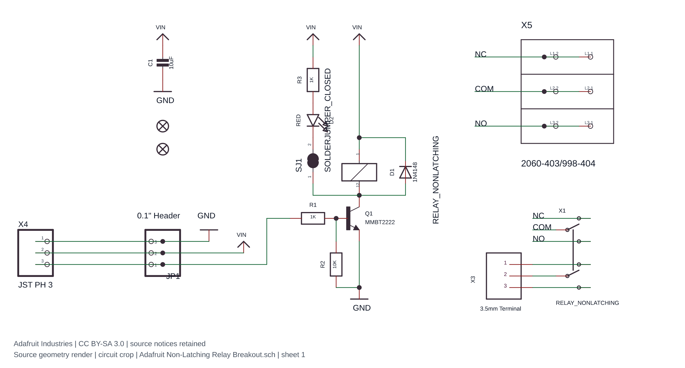

<details>
<summary>Complete system instruction and original first-turn evidence prompt</summary>

```text
You answer factual questions about the attached schematic and its extracted source evidence. Use only the supplied evidence. Identify connections as REFDES.PAD, where PAD is the physical package pad number. Distinguish schematic facts from design judgments. Do not invent missing components, specifications, measurements, or safety findings.
```

```text
Extracted native schematic evidence (not an electrical review):
{"scope": "this sheet only; physical package pad numbers, not symbol pin labels", "bom": [{"refdes": "C1", "value": "10uF"}, {"refdes": "D1", "value": "1N4148"}, {"refdes": "D2", "value": "RED"}, {"refdes": "FID2", "value": ""}, {"refdes": "FID3", "value": ""}, {"refdes": "JP1", "value": "0.1\" Header"}, {"refdes": "Q1", "value": "MMBT2222"}, {"refdes": "R1", "value": "1K"}, {"refdes": "R2", "value": "10K"}, {"refdes": "R3", "value": "1K"}, {"refdes": "SJ1", "value": ""}, {"refdes": "U$1", "value": ""}, {"refdes": "U$10", "value": ""}, {"refdes": "U$8", "value": ""}, {"refdes": "U$9", "value": ""}, {"refdes": "X1", "value": ""}, {"refdes": "X3", "value": "3.5mm Terminal"}, {"refdes": "X4", "value": "JST PH 3"}, {"refdes": "X5", "value": ""}], "nets": {"COM": ["X1.9", "X5.L2.1", "X5.L2.2"], "GND": ["C1.2", "JP1.3", "Q1.2", "R2.1", "X4.1"], "N$1": ["D1.A", "Q1.3", "SJ1.1", "X1.12"], "N$2": ["X1.3", "X3.1"], "N$22": ["Q1.1", "R1.2", "R2.2"], "N$25": ["D2.C", "SJ1.2"], "N$26": ["D2.A", "R3.1"], "N$3": ["X1.4", "X3.2"], "N$4": ["X1.5", "X3.3"], "NC": ["X1.10", "X5.L1.1", "X5.L1.2"], "NO": ["X1.8", "X5.L3.1", "X5.L3.2"], "SIGNAL": ["JP1.1", "R1.1", "X4.3"], "VIN": ["C1.1", "D1.C", "JP1.2", "R3.2", "X1.1", "X4.2"]}}

What value is recorded for R1?
```

</details>

**User 1**

```text
What value is recorded for R1?
```

**Assistant 1 — simulated gold**

```text
R1 has value 1K in the source schematic.
```

**User 2**

```text
Which physical component pads connect to net SIGNAL on this sheet?
```

**Assistant 2 — simulated gold**

```text
On this sheet, SIGNAL connects JP1.1, R1.1, X4.3.
```

**User 3**

```text
Trace JP1.1: which other physical pads share its net on this sheet?
```

**Assistant 3 — simulated gold**

```text
JP1.1 is on SIGNAL, together with R1.1, X4.3.
```

**User 4**

```text
What is the specified value of R2?
```

**Assistant 4 — simulated gold**

```text
R2 has value 10K in the source schematic.
```

**User 5**

```text
What value is R9999, and what does it connect to?
```

**Assistant 5 — simulated gold**

```text
There is no R9999 in the supplied sheet evidence. Its value and connections are not shown.
```

**User 6**

```text
What measured voltage was observed at JP1.1 during a powered bench test?
```

**Assistant 6 — simulated gold**

```text
No bench measurement is supplied in this schematic or source evidence. I cannot infer a measured voltage.
```

## 8. adafruit/Adafruit-STEMMA-Piezo-Driver-Amp-PCB

Conversation `real-eb4bbea6c221bd11-p1` · dataset split `train` · source commit `678bf96ec53107bd831f84c2aebca380a3bd4157`.

[Original schematic](https://github.com/adafruit/Adafruit-STEMMA-Piezo-Driver-Amp-PCB/blob/678bf96ec53107bd831f84c2aebca380a3bd4157/Adafruit%20STEMMA%20Piezo%20Driver%20Amp.sch) · [CC BY-SA 3.0 license](https://github.com/adafruit/Adafruit-STEMMA-Piezo-Driver-Amp-PCB/blob/678bf96ec53107bd831f84c2aebca380a3bd4157/license.txt)

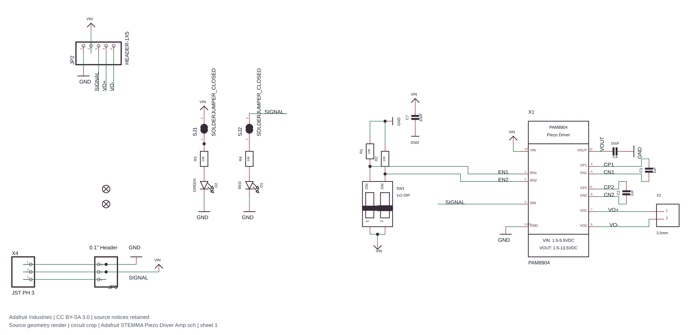

<details>
<summary>Complete system instruction and original first-turn evidence prompt</summary>

```text
You answer factual questions about the attached schematic and its extracted source evidence. Use only the supplied evidence. Identify connections as REFDES.PAD, where PAD is the physical package pad number. Distinguish schematic facts from design judgments. Do not invent missing components, specifications, measurements, or safety findings.
```

```text
Extracted native schematic evidence (not an electrical review):
{"scope": "this sheet only; physical package pad numbers, not symbol pin labels", "bom": [{"refdes": "C1", "value": "1uF"}, {"refdes": "C2", "value": "1uF"}, {"refdes": "C4", "value": "10uF"}, {"refdes": "C7", "value": "10uF"}, {"refdes": "D1", "value": "RED"}, {"refdes": "D2", "value": "GREEN"}, {"refdes": "FID2", "value": ""}, {"refdes": "FID3", "value": ""}, {"refdes": "JP1", "value": "0.1\" Header"}, {"refdes": "JP2", "value": ""}, {"refdes": "R1", "value": "10K"}, {"refdes": "R2", "value": "10K"}, {"refdes": "R3", "value": "10K"}, {"refdes": "R4", "value": "10K"}, {"refdes": "SJ1", "value": ""}, {"refdes": "SJ2", "value": ""}, {"refdes": "SW1", "value": "1x2-DIP"}, {"refdes": "U$1", "value": ""}, {"refdes": "U$8", "value": ""}, {"refdes": "X1", "value": ""}, {"refdes": "X2", "value": "3.5mm"}, {"refdes": "X4", "value": "JST PH 3"}], "nets": {"CN1": ["C1.2", "X1.4"], "CN2": ["C2.2", "X1.8"], "CP1": ["C1.1", "X1.9"], "CP2": ["C2.1", "X1.11"], "EN1": ["R1.1", "SW1.1ON", "X1.1"], "EN2": ["R2.1", "SW1.2ON", "X1.2"], "GND": ["C4.2", "C7.2", "D1.C", "D2.C", "JP1.3", "JP2.1", "R1.2", "R2.2", "X1.5", "X1.MT", "X4.1"], "N$1": ["R3.2", "SJ1.1"], "N$10": ["R4.2", "SJ2.1"], "N$26": ["D2.A", "R3.1"], "N$9": ["D1.A", "R4.1"], "SIGNAL": ["JP1.1", "JP2.3", "SJ2.2", "X1.3", "X4.3"], "VIN": ["C7.1", "JP1.2", "JP2.2", "SJ1.2", "SW1.1OFF", "SW1.2OFF", "X1.12", "X4.2"], "VO+": ["JP2.4", "X1.7", "X2.1"], "VO-": ["JP2.5", "X1.6", "X2.2"], "VOUT": ["C4.1", "X1.10"]}}

What value is recorded for R1?
```

</details>

**User 1**

```text
What value is recorded for R1?
```

**Assistant 1 — simulated gold**

```text
R1 has value 10K in the source schematic.
```

**User 2**

```text
Which physical component pads connect to net CN1 on this sheet?
```

**Assistant 2 — simulated gold**

```text
On this sheet, CN1 connects C1.2, X1.4.
```

**User 3**

```text
Trace C1.2: which other physical pads share its net on this sheet?
```

**Assistant 3 — simulated gold**

```text
C1.2 is on CN1, together with X1.4.
```

**User 4**

```text
What is the specified value of R2?
```

**Assistant 4 — simulated gold**

```text
R2 has value 10K in the source schematic.
```

**User 5**

```text
What value is R9999, and what does it connect to?
```

**Assistant 5 — simulated gold**

```text
There is no R9999 in the supplied sheet evidence. Its value and connections are not shown.
```

**User 6**

```text
What measured voltage was observed at C1.2 during a powered bench test?
```

**Assistant 6 — simulated gold**

```text
No bench measurement is supplied in this schematic or source evidence. I cannot infer a measured voltage.
```

## 9. adafruit/Adafruit-STEMMA-Reflective-Photo-Interrupt-Sensor-PCB

Conversation `real-1084d67e335e10aa-p1` · dataset split `test` · source commit `301c949dc5f3d4b045aca5ca94913a096af24918`.

[Original schematic](https://github.com/adafruit/Adafruit-STEMMA-Reflective-Photo-Interrupt-Sensor-PCB/blob/301c949dc5f3d4b045aca5ca94913a096af24918/Adafruit%20STEMMA%20Reflective%20Photo%20Interrupt%20Sensor.sch) · [CC BY-SA 3.0 license](https://github.com/adafruit/Adafruit-STEMMA-Reflective-Photo-Interrupt-Sensor-PCB/blob/301c949dc5f3d4b045aca5ca94913a096af24918/license.txt)

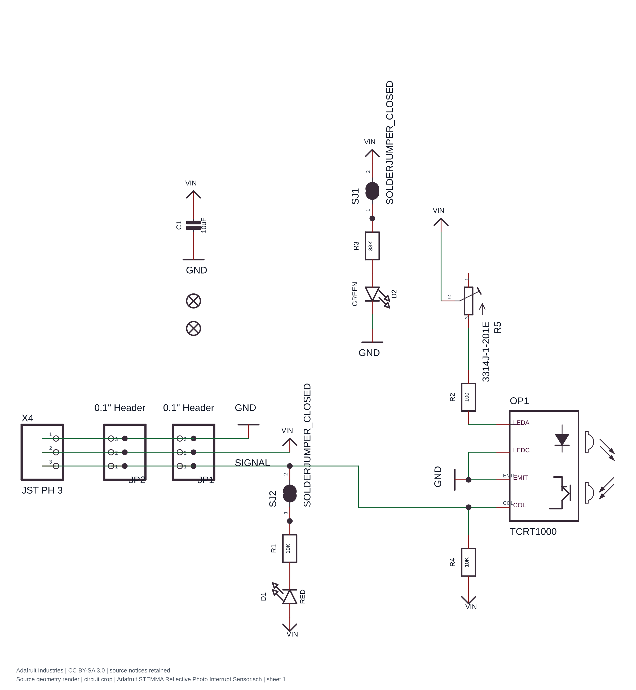

<details>
<summary>Complete system instruction and original first-turn evidence prompt</summary>

```text
You answer factual questions about the attached schematic and its extracted source evidence. Use only the supplied evidence. Identify connections as REFDES.PAD, where PAD is the physical package pad number. Distinguish schematic facts from design judgments. Do not invent missing components, specifications, measurements, or safety findings.
```

```text
Extracted native schematic evidence (not an electrical review):
{"scope": "this sheet only; physical package pad numbers, not symbol pin labels", "bom": [{"refdes": "C1", "value": "10uF"}, {"refdes": "D1", "value": "RED"}, {"refdes": "D2", "value": "GREEN"}, {"refdes": "FID2", "value": ""}, {"refdes": "FID3", "value": ""}, {"refdes": "JP1", "value": "0.1\" Header"}, {"refdes": "JP2", "value": "0.1\" Header"}, {"refdes": "OP1", "value": ""}, {"refdes": "R1", "value": "10K"}, {"refdes": "R2", "value": "100"}, {"refdes": "R3", "value": "33K"}, {"refdes": "R4", "value": "10K"}, {"refdes": "R5", "value": "3314J-1-201E"}, {"refdes": "SJ1", "value": ""}, {"refdes": "SJ2", "value": ""}, {"refdes": "U$1", "value": ""}, {"refdes": "U$8", "value": ""}, {"refdes": "X4", "value": "JST PH 3"}], "nets": {"GND": ["C1.2", "D2.C", "JP1.3", "JP2.3", "OP1.EMIT", "OP1.LEDC", "X4.1"], "N$1": ["R3.2", "SJ1.1"], "N$2": ["D1.C", "R1.1"], "N$26": ["D2.A", "R3.1"], "N$3": ["R1.2", "SJ2.1"], "N$4": ["R2.2", "R5.3"], "N$5": ["OP1.LEDA", "R2.1"], "SIGNAL": ["JP1.1", "JP2.1", "OP1.COL", "R4.2", "SJ2.2", "X4.3"], "VIN": ["C1.1", "D1.A", "JP1.2", "JP2.2", "R4.1", "R5.2", "SJ1.2", "X4.2"]}}

What value is recorded for R1?
```

</details>

**User 1**

```text
What value is recorded for R1?
```

**Assistant 1 — simulated gold**

```text
R1 has value 10K in the source schematic.
```

**User 2**

```text
Which physical component pads connect to net SIGNAL on this sheet?
```

**Assistant 2 — simulated gold**

```text
On this sheet, SIGNAL connects JP1.1, JP2.1, OP1.COL, R4.2, SJ2.2, X4.3.
```

**User 3**

```text
Trace JP1.1: which other physical pads share its net on this sheet?
```

**Assistant 3 — simulated gold**

```text
JP1.1 is on SIGNAL, together with JP2.1, OP1.COL, R4.2, SJ2.2, X4.3.
```

**User 4**

```text
What is the specified value of R2?
```

**Assistant 4 — simulated gold**

```text
R2 has value 100 in the source schematic.
```

**User 5**

```text
What value is R9999, and what does it connect to?
```

**Assistant 5 — simulated gold**

```text
There is no R9999 in the supplied sheet evidence. Its value and connections are not shown.
```

**User 6**

```text
What measured voltage was observed at JP1.1 during a powered bench test?
```

**Assistant 6 — simulated gold**

```text
No bench measurement is supplied in this schematic or source evidence. I cannot infer a measured voltage.
```

## 10. adafruit/Adafruit-STEMMA-Soil-Sensor-PCB

Conversation `real-c03d0994b59640a8-p1` · dataset split `test` · source commit `b20a708dd015cb81da8740460d47aae1555a1781`.

[Original schematic](https://github.com/adafruit/Adafruit-STEMMA-Soil-Sensor-PCB/blob/b20a708dd015cb81da8740460d47aae1555a1781/Adafruit%20STEMMA%20Soil%20Sensor.sch) · [CC BY-SA 3.0 license](https://github.com/adafruit/Adafruit-STEMMA-Soil-Sensor-PCB/blob/b20a708dd015cb81da8740460d47aae1555a1781/license.txt)

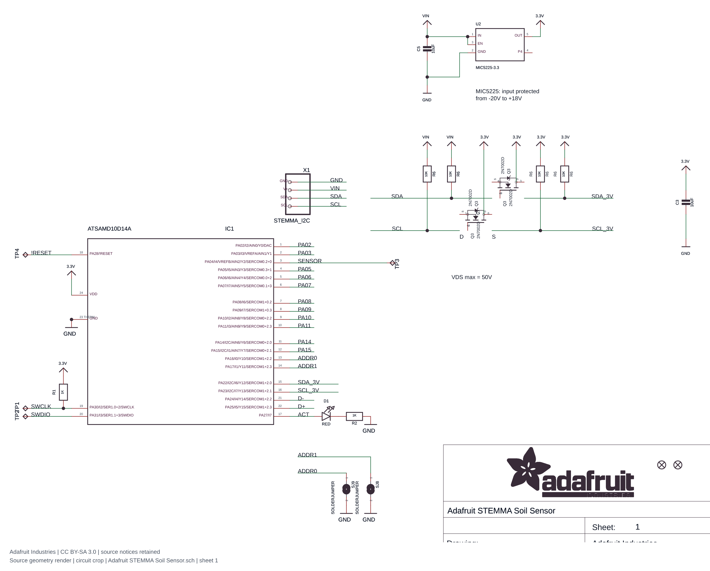

<details>
<summary>Complete system instruction and original first-turn evidence prompt</summary>

```text
You answer factual questions about the attached schematic and its extracted source evidence. Use only the supplied evidence. Identify connections as REFDES.PAD, where PAD is the physical package pad number. Distinguish schematic facts from design judgments. Do not invent missing components, specifications, measurements, or safety findings.
```

```text
Extracted native schematic evidence (not an electrical review):
{"scope": "this sheet only; physical package pad numbers, not symbol pin labels", "bom": [{"refdes": "C3", "value": "10uF"}, {"refdes": "C5", "value": "10uF"}, {"refdes": "D1", "value": "RED"}, {"refdes": "FID1", "value": ""}, {"refdes": "FID2", "value": ""}, {"refdes": "IC1", "value": ""}, {"refdes": "Q3", "value": "2N7002D"}, {"refdes": "R1", "value": "1K"}, {"refdes": "R2", "value": "1K"}, {"refdes": "R6", "value": "10K"}, {"refdes": "SJ8", "value": ""}, {"refdes": "SJ9", "value": ""}, {"refdes": "TP1", "value": "TPTP15R"}, {"refdes": "TP2", "value": "TPTP15R"}, {"refdes": "TP3", "value": ""}, {"refdes": "TP4", "value": "TPTP15R"}, {"refdes": "U2", "value": "MIC5225-3.3"}, {"refdes": "X1", "value": ""}], "nets": {"!RESET": ["IC1.18", "TP4.TP"], "3.3V": ["C3.1", "IC1.24", "Q3.2", "Q3.5", "R1.2", "R6.1", "R6.5", "U2.5"], "ACT": ["D1.A", "IC1.17"], "ADDR0": ["IC1.13", "SJ9.1"], "ADDR1": ["IC1.14", "SJ8.1"], "D+": ["IC1.22"], "D-": ["IC1.21"], "GND": ["C3.2", "C5.2", "IC1.23", "IC1.THERM", "R2.1", "SJ8.2", "SJ9.2", "U2.2", "X1.1"], "N$2": ["D1.C", "R2.2"], "PA02": ["IC1.1"], "PA03": ["IC1.2"], "PA05": ["IC1.4"], "PA06": ["IC1.5"], "PA07": ["IC1.6"], "PA08": ["IC1.7"], "PA09": ["IC1.8"], "PA10": ["IC1.9"], "PA11": ["IC1.10"], "PA14": ["IC1.11"], "PA15": ["IC1.12"], "SCL": ["Q3.6", "R6.6", "X1.4"], "SCL_3V": ["IC1.16", "Q3.1", "R6.4"], "SDA": ["Q3.3", "R6.7", "X1.3"], "SDA_3V": ["IC1.15", "Q3.4", "R6.8"], "SENSOR": ["IC1.3", "TP3.TP"], "SWCLK": ["IC1.19", "R1.1", "TP1.TP"], "SWDIO": ["IC1.20", "TP2.TP"], "VIN": ["C5.1", "R6.2", "R6.3", "U2.1", "U2.3", "X1.2"]}}

What value is recorded for R1?
```

</details>

**User 1**

```text
What value is recorded for R1?
```

**Assistant 1 — simulated gold**

```text
R1 has value 1K in the source schematic.
```

**User 2**

```text
Which physical component pads connect to net !RESET on this sheet?
```

**Assistant 2 — simulated gold**

```text
On this sheet, !RESET connects IC1.18, TP4.TP.
```

**User 3**

```text
Trace IC1.18: which other physical pads share its net on this sheet?
```

**Assistant 3 — simulated gold**

```text
IC1.18 is on !RESET, together with TP4.TP.
```

**User 4**

```text
What is the specified value of R2?
```

**Assistant 4 — simulated gold**

```text
R2 has value 1K in the source schematic.
```

**User 5**

```text
What value is R9999, and what does it connect to?
```

**Assistant 5 — simulated gold**

```text
There is no R9999 in the supplied sheet evidence. Its value and connections are not shown.
```

**User 6**

```text
What measured voltage was observed at IC1.18 during a powered bench test?
```

**Assistant 6 — simulated gold**

```text
No bench measurement is supplied in this schematic or source evidence. I cannot infer a measured voltage.
```

## 11. adafruit/Adafruit-STEMMA-Speaker-PCB

Conversation `real-409c942e81f9fa23-p1` · dataset split `train` · source commit `2f4a20b1411e8ead3160e6e89889f20311b248a1`.

[Original schematic](https://github.com/adafruit/Adafruit-STEMMA-Speaker-PCB/blob/2f4a20b1411e8ead3160e6e89889f20311b248a1/Adafruit%20STEMMA%20Speaker.sch) · [CC BY-SA 3.0 license](https://github.com/adafruit/Adafruit-STEMMA-Speaker-PCB/blob/2f4a20b1411e8ead3160e6e89889f20311b248a1/license.txt)

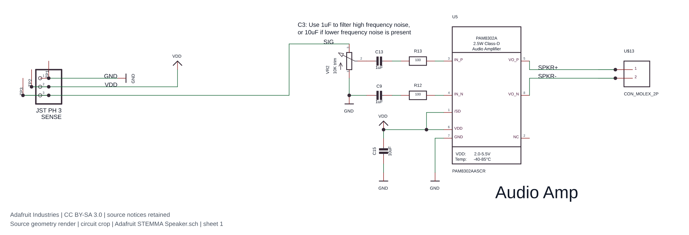

<details>
<summary>Complete system instruction and original first-turn evidence prompt</summary>

```text
You answer factual questions about the attached schematic and its extracted source evidence. Use only the supplied evidence. Identify connections as REFDES.PAD, where PAD is the physical package pad number. Distinguish schematic facts from design judgments. Do not invent missing components, specifications, measurements, or safety findings.
```

```text
Extracted native schematic evidence (not an electrical review):
{"scope": "this sheet only; physical package pad numbers, not symbol pin labels", "bom": [{"refdes": "C13", "value": "1uF"}, {"refdes": "C15", "value": "10uF"}, {"refdes": "C9", "value": "1uF"}, {"refdes": "FID1", "value": ""}, {"refdes": "FID2", "value": ""}, {"refdes": "R12", "value": "100"}, {"refdes": "R13", "value": "100"}, {"refdes": "SENSE", "value": "JST PH 3"}, {"refdes": "TP1", "value": ""}, {"refdes": "TP2", "value": ""}, {"refdes": "TP3", "value": ""}, {"refdes": "U$10", "value": ""}, {"refdes": "U$11", "value": ""}, {"refdes": "U$12", "value": ""}, {"refdes": "U$13", "value": ""}, {"refdes": "U$9", "value": ""}, {"refdes": "U5", "value": "PAM8302AASCR"}, {"refdes": "VR2", "value": "10K trim"}], "nets": {"GND": ["C15.2", "C9.2", "SENSE.1", "TP1.P$1", "U5.7", "VR2.1"], "N$19": ["R12.2", "U5.4"], "N$20": ["R13.2", "U5.3"], "N$21": ["C9.1", "R12.1"], "N$22": ["C13.1", "R13.1"], "N$23": ["C13.2", "VR2.2"], "SIG": ["SENSE.3", "TP3.P$1", "VR2.3"], "SPKR+": ["U$13.1", "U5.5"], "SPKR-": ["U$13.2", "U5.8"], "VDD": ["C15.1", "SENSE.2", "TP2.P$1", "U5.1", "U5.6"]}}

What value is recorded for R12?
```

</details>

**User 1**

```text
What value is recorded for R12?
```

**Assistant 1 — simulated gold**

```text
R12 has value 100 in the source schematic.
```

**User 2**

```text
Which physical component pads connect to net SPKR+ on this sheet?
```

**Assistant 2 — simulated gold**

```text
On this sheet, SPKR+ connects U$13.1, U5.5.
```

**User 3**

```text
Trace U$13.1: which other physical pads share its net on this sheet?
```

**Assistant 3 — simulated gold**

```text
U$13.1 is on SPKR+, together with U5.5.
```

**User 4**

```text
What is the specified value of R13?
```

**Assistant 4 — simulated gold**

```text
R13 has value 100 in the source schematic.
```

**User 5**

```text
What value is R9999, and what does it connect to?
```

**Assistant 5 — simulated gold**

```text
There is no R9999 in the supplied sheet evidence. Its value and connections are not shown.
```

**User 6**

```text
What measured voltage was observed at U$13.1 during a powered bench test?
```

**Assistant 6 — simulated gold**

```text
No bench measurement is supplied in this schematic or source evidence. I cannot infer a measured voltage.
```

## 12. adafruit/Adafruit-STHS34PF80-IR-Presence-Sensor-PCB

Conversation `real-48e0b6d5f16e4d2f-p1` · dataset split `train` · source commit `df3aece9ec5e5ad5f1a1fe48835046ddb6b0a292`.

[Original schematic](https://github.com/adafruit/Adafruit-STHS34PF80-IR-Presence-Sensor-PCB/blob/df3aece9ec5e5ad5f1a1fe48835046ddb6b0a292/Adafruit%20STHS34PF80%20IR%20Presence%20Sensor.sch) · [CC BY-SA 3.0 license](https://github.com/adafruit/Adafruit-STHS34PF80-IR-Presence-Sensor-PCB/blob/df3aece9ec5e5ad5f1a1fe48835046ddb6b0a292/license.txt)

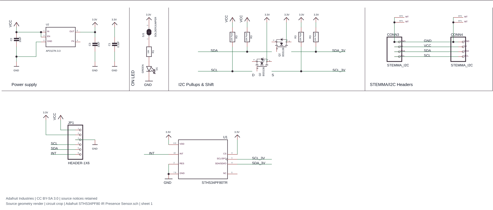

<details>
<summary>Complete system instruction and original first-turn evidence prompt</summary>

```text
You answer factual questions about the attached schematic and its extracted source evidence. Use only the supplied evidence. Identify connections as REFDES.PAD, where PAD is the physical package pad number. Distinguish schematic facts from design judgments. Do not invent missing components, specifications, measurements, or safety findings.
```

```text
Extracted native schematic evidence (not an electrical review):
{"scope": "this sheet only; physical package pad numbers, not symbol pin labels", "bom": [{"refdes": "C1", "value": "0.1uF"}, {"refdes": "C2", "value": "10uF"}, {"refdes": "C3", "value": "10uF"}, {"refdes": "CONN3", "value": ""}, {"refdes": "CONN4", "value": ""}, {"refdes": "D1", "value": "GREEN"}, {"refdes": "FID3", "value": "FIDUCIAL_0.5MM"}, {"refdes": "FID4", "value": "FIDUCIAL_0.5MM"}, {"refdes": "JP1", "value": ""}, {"refdes": "Q2", "value": "BSS138"}, {"refdes": "R1", "value": "10K"}, {"refdes": "R3", "value": "10K Pack"}, {"refdes": "SJ1", "value": ""}, {"refdes": "U$1", "value": "MOUNTINGHOLE2.5"}, {"refdes": "U$17", "value": "MOUNTINGHOLE2.5"}, {"refdes": "U$19", "value": "MOUNTINGHOLE2.5"}, {"refdes": "U$21", "value": "MOUNTINGHOLE2.5"}, {"refdes": "U1", "value": ""}, {"refdes": "U2", "value": "AP2127K-3.3"}], "nets": {"3.3V": ["C1.1", "C3.1", "JP1.2", "Q2.2", "Q2.5", "R3.2", "R3.4", "SJ1.2", "U1.3", "U1.6", "U1.9", "U2.5"], "GND": ["C1.2", "C2.2", "C3.2", "CONN3.1", "CONN3.MT1", "CONN3.MT2", "CONN4.1", "CONN4.MT1", "CONN4.MT2", "D1.C", "JP1.3", "U1.2", "U1.7", "U1.8", "U2.2"], "INT": ["JP1.6", "U1.10"], "N$1": ["D1.A", "R1.2"], "N$2": ["R1.1", "SJ1.1"], "SCL": ["CONN3.4", "CONN4.4", "JP1.4", "Q2.6", "R3.8"], "SCL_3V": ["Q2.1", "R3.7", "U1.1"], "SDA": ["CONN3.3", "CONN4.3", "JP1.5", "Q2.3", "R3.6"], "SDA_3V": ["Q2.4", "R3.5", "U1.4"], "VCC": ["C2.1", "CONN3.2", "CONN4.2", "JP1.1", "R3.1", "R3.3", "U2.1", "U2.3"]}}

What value is recorded for R1?
```

</details>

**User 1**

```text
What value is recorded for R1?
```

**Assistant 1 — simulated gold**

```text
R1 has value 10K in the source schematic.
```

**User 2**

```text
Which physical component pads connect to net INT on this sheet?
```

**Assistant 2 — simulated gold**

```text
On this sheet, INT connects JP1.6, U1.10.
```

**User 3**

```text
Trace JP1.6: which other physical pads share its net on this sheet?
```

**Assistant 3 — simulated gold**

```text
JP1.6 is on INT, together with U1.10.
```

**User 4**

```text
What is the specified value of R3?
```

**Assistant 4 — simulated gold**

```text
R3 has value 10K Pack in the source schematic.
```

**User 5**

```text
What value is R9999, and what does it connect to?
```

**Assistant 5 — simulated gold**

```text
There is no R9999 in the supplied sheet evidence. Its value and connections are not shown.
```

**User 6**

```text
What measured voltage was observed at JP1.6 during a powered bench test?
```

**Assistant 6 — simulated gold**

```text
No bench measurement is supplied in this schematic or source evidence. I cannot infer a measured voltage.
```

## 13. adafruit/Adafruit-STMPE610-Breakout-PCB

Conversation `real-345815802bcdb2b6-p1` · dataset split `val` · source commit `8cf4f3cc9aaa31c6f5b90e661fa7ba99559052bb`.

[Original schematic](https://github.com/adafruit/Adafruit-STMPE610-Breakout-PCB/blob/8cf4f3cc9aaa31c6f5b90e661fa7ba99559052bb/Adafruit%20STMPE610.sch) · [CC BY-SA 3.0 license](https://github.com/adafruit/Adafruit-STMPE610-Breakout-PCB/blob/8cf4f3cc9aaa31c6f5b90e661fa7ba99559052bb/license.txt)

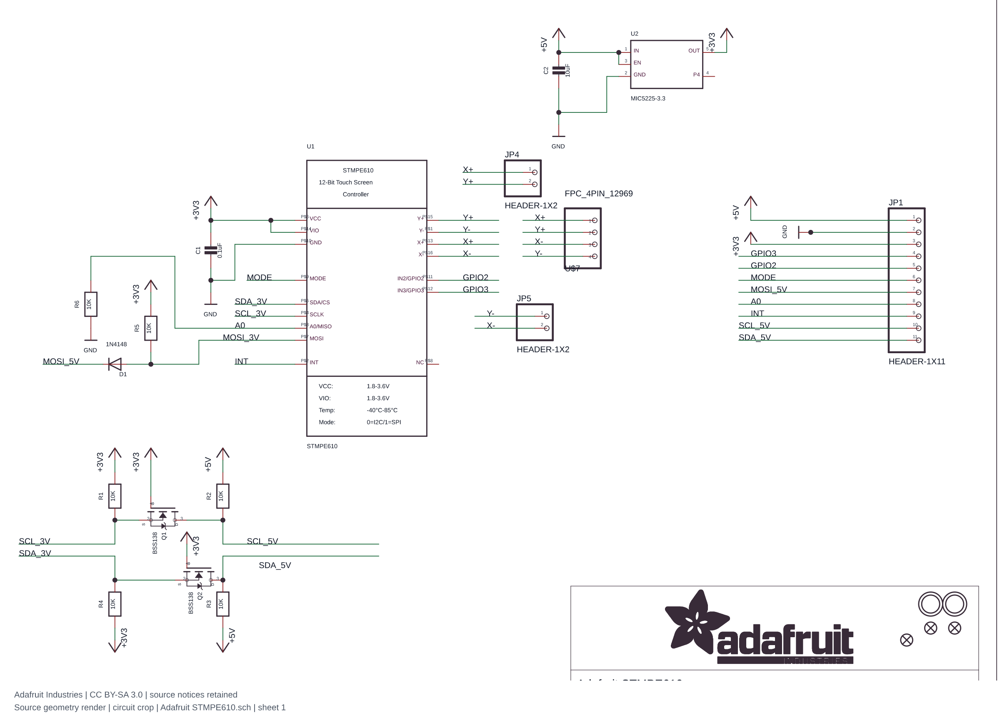

<details>
<summary>Complete system instruction and original first-turn evidence prompt</summary>

```text
You answer factual questions about the attached schematic and its extracted source evidence. Use only the supplied evidence. Identify connections as REFDES.PAD, where PAD is the physical package pad number. Distinguish schematic facts from design judgments. Do not invent missing components, specifications, measurements, or safety findings.
```

```text
Extracted native schematic evidence (not an electrical review):
{"scope": "this sheet only; physical package pad numbers, not symbol pin labels", "bom": [{"refdes": "C1", "value": "0.1uF"}, {"refdes": "C2", "value": "10uF"}, {"refdes": "D1", "value": "1N4148"}, {"refdes": "FID1", "value": ""}, {"refdes": "FID2", "value": ""}, {"refdes": "FID3", "value": ""}, {"refdes": "JP1", "value": ""}, {"refdes": "JP4", "value": ""}, {"refdes": "JP5", "value": ""}, {"refdes": "Q1", "value": "BSS138"}, {"refdes": "Q2", "value": "BSS138"}, {"refdes": "R1", "value": "10K"}, {"refdes": "R2", "value": "10K"}, {"refdes": "R3", "value": "10K"}, {"refdes": "R4", "value": "10K"}, {"refdes": "R5", "value": "10K"}, {"refdes": "R6", "value": "10K"}, {"refdes": "U$4", "value": ""}, {"refdes": "U$5", "value": ""}, {"refdes": "U$7", "value": "FPC_4PIN_12969"}, {"refdes": "U1", "value": "STMPE610"}, {"refdes": "U2", "value": "MIC5225-3.3"}], "nets": {"+3V3": ["C1.1", "JP1.3", "Q1.1", "Q2.1", "R1.2", "R4.1", "R5.2", "U1.P$14", "U1.P$6", "U2.5"], "+5V": ["C2.1", "JP1.1", "R2.2", "R3.1", "U2.1", "U2.3"], "A0": ["JP1.8", "R6.2", "U1.P$3"], "GND": ["C1.2", "C2.2", "JP1.2", "R6.1", "U1.P$10", "U2.2"], "GPIO2": ["JP1.5", "U1.P$11"], "GPIO3": ["JP1.4", "U1.P$12"], "INT": ["JP1.9", "U1.P$2"], "MODE": ["JP1.6", "U1.P$9"], "MOSI_3V": ["D1.A", "R5.1", "U1.P$7"], "MOSI_5V": ["D1.C", "JP1.7"], "SCL_3V": ["Q1.2", "R1.1", "U1.P$4"], "SCL_5V": ["JP1.10", "Q1.3", "R2.1"], "SDA_3V": ["Q2.2", "R4.2", "U1.P$5"], "SDA_5V": ["JP1.11", "Q2.3", "R3.2"], "X+": ["JP4.1", "U$7.1", "U1.P$13"], "X-": ["JP5.2", "U$7.3", "U1.P$16"], "Y+": ["JP4.2", "U$7.2", "U1.P$15"], "Y-": ["JP5.1", "U$7.4", "U1.P$1"]}}

What value is recorded for R1?
```

</details>

**User 1**

```text
What value is recorded for R1?
```

**Assistant 1 — simulated gold**

```text
R1 has value 10K in the source schematic.
```

**User 2**

```text
Which physical component pads connect to net GPIO2 on this sheet?
```

**Assistant 2 — simulated gold**

```text
On this sheet, GPIO2 connects JP1.5, U1.P$11.
```

**User 3**

```text
Trace JP1.5: which other physical pads share its net on this sheet?
```

**Assistant 3 — simulated gold**

```text
JP1.5 is on GPIO2, together with U1.P$11.
```

**User 4**

```text
What is the specified value of R2?
```

**Assistant 4 — simulated gold**

```text
R2 has value 10K in the source schematic.
```

**User 5**

```text
What value is R9999, and what does it connect to?
```

**Assistant 5 — simulated gold**

```text
There is no R9999 in the supplied sheet evidence. Its value and connections are not shown.
```

**User 6**

```text
What measured voltage was observed at JP1.5 during a powered bench test?
```

**Assistant 6 — simulated gold**

```text
No bench measurement is supplied in this schematic or source evidence. I cannot infer a measured voltage.
```

## 14. adafruit/Adafruit-STSPIN220-Stepper-Motor-Driver-Breakout-Board-PCB

Conversation `real-415fae4356e66269-p1` · dataset split `train` · source commit `900c418203489887894b71debe1849a6df259c0f`.

[Original schematic](https://github.com/adafruit/Adafruit-STSPIN220-Stepper-Motor-Driver-Breakout-Board-PCB/blob/900c418203489887894b71debe1849a6df259c0f/Adafruit%20STSPIN220%20Stepper%20Motor%20Driver.sch) · [CC BY-SA 3.0 license](https://github.com/adafruit/Adafruit-STSPIN220-Stepper-Motor-Driver-Breakout-Board-PCB/blob/900c418203489887894b71debe1849a6df259c0f/license.txt)

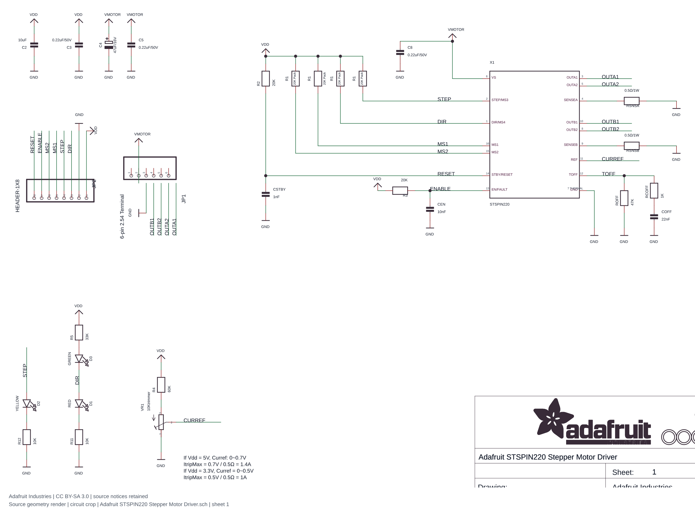

<details>
<summary>Complete system instruction and original first-turn evidence prompt</summary>

```text
You answer factual questions about the attached schematic and its extracted source evidence. Use only the supplied evidence. Identify connections as REFDES.PAD, where PAD is the physical package pad number. Distinguish schematic facts from design judgments. Do not invent missing components, specifications, measurements, or safety findings.
```

```text
Extracted native schematic evidence (not an electrical review):
{"scope": "this sheet only; physical package pad numbers, not symbol pin labels", "bom": [{"refdes": "C2", "value": "10uF"}, {"refdes": "C3", "value": "0.22uF/50V"}, {"refdes": "C4", "value": "47uF/16V"}, {"refdes": "C5", "value": "0.22uF/50V"}, {"refdes": "C8", "value": "0.22uF/50V"}, {"refdes": "CEN", "value": "10nF"}, {"refdes": "COFF", "value": "22nF"}, {"refdes": "CSTBY", "value": "1nF"}, {"refdes": "D1", "value": "RED"}, {"refdes": "D2", "value": "YELLOW"}, {"refdes": "D3", "value": "GREEN"}, {"refdes": "JP1", "value": "6-pin 2.54 Terminal"}, {"refdes": "JP2", "value": ""}, {"refdes": "R1", "value": "20K Pack"}, {"refdes": "R11", "value": "10K"}, {"refdes": "R12", "value": "10K"}, {"refdes": "R2", "value": "20K"}, {"refdes": "R3", "value": "20K"}, {"refdes": "R4", "value": "60K"}, {"refdes": "R5", "value": "33K"}, {"refdes": "RCOFF", "value": "1K"}, {"refdes": "ROFF", "value": "47K"}, {"refdes": "RSNSA", "value": "0.5\u03a9/1W"}, {"refdes": "RSNSB", "value": "0.5\u03a9/1W"}, {"refdes": "U$10", "value": ""}, {"refdes": "U$11", "value": ""}, {"refdes": "U$18", "value": "MOUNTINGHOLE2.0"}, {"refdes": "U$22", "value": "MOUNTINGHOLE2.0"}, {"refdes": "U$26", "value": "MOUNTINGHOLE2.0"}, {"refdes": "U$27", "value": "MOUNTINGHOLE2.0"}, {"refdes": "VR1", "value": "10Ktrimmer"}, {"refdes": "X1", "value": ""}], "nets": {"CURREF": ["VR1.2", "X1.11"], "DIR": ["D1.A", "D3.C", "JP2.3", "R1.2", "X1.1"], "ENABLE": ["CEN.1", "JP2.7", "R3.1", "X1.13"], "GND": ["C2.1", "C3.1", "C4.-", "C5.2", "C8.2", "CEN.2", "COFF.2", "CSTBY.2", "JP1.5", "JP2.2", "R11.1", "R12.1", "ROFF.1", "RSNSA.1", "RSNSB.1", "VR1.1", "X1.7", "X1.THERMAL"], "MS1": ["JP2.5", "R1.3", "X1.16"], "MS2": ["JP2.6", "R1.4", "X1.15"], "N$1": ["D2.C", "R12.2"], "N$10": ["D3.A", "R5.1"], "N$4": ["COFF.1", "RCOFF.1"], "N$5": ["RSNSA.2", "X1.4"], "N$6": ["RSNSB.2", "X1.9"], "N$8": ["D1.C", "R11.2"], "N$9": ["R4.1", "VR1.3"], "OUTA1": ["JP1.1", "X1.3"], "OUTA2": ["JP1.2", "X1.5"], "OUTB1": ["JP1.4", "X1.10"], "OUTB2": ["JP1.3", "X1.8"], "RESET": ["CSTBY.1", "JP2.8", "R2.1", "X1.14"], "STEP": ["D2.A", "JP2.4", "R1.1", "X1.2"], "TOFF": ["RCOFF.2", "ROFF.2", "X1.12"], "VDD": ["C2.2", "C3.2", "JP2.1", "R1.5", "R1.6", "R1.7", "R1.8", "R2.2", "R3.2", "R4.2", "R5.2"], "VMOTOR": ["C4.+", "C5.1", "C8.1", "JP1.6", "X1.6"]}}

What value is recorded for R1?
```

</details>

**User 1**

```text
What value is recorded for R1?
```

**Assistant 1 — simulated gold**

```text
R1 has value 20K Pack in the source schematic.
```

**User 2**

```text
Which physical component pads connect to net CURREF on this sheet?
```

**Assistant 2 — simulated gold**

```text
On this sheet, CURREF connects VR1.2, X1.11.
```

**User 3**

```text
Trace VR1.2: which other physical pads share its net on this sheet?
```

**Assistant 3 — simulated gold**

```text
VR1.2 is on CURREF, together with X1.11.
```

**User 4**

```text
What is the specified value of R11?
```

**Assistant 4 — simulated gold**

```text
R11 has value 10K in the source schematic.
```

**User 5**

```text
What value is R9999, and what does it connect to?
```

**Assistant 5 — simulated gold**

```text
There is no R9999 in the supplied sheet evidence. Its value and connections are not shown.
```

**User 6**

```text
What measured voltage was observed at VR1.2 during a powered bench test?
```

**Assistant 6 — simulated gold**

```text
No bench measurement is supplied in this schematic or source evidence. I cannot infer a measured voltage.
```

## 15. adafruit/Adafruit-Standalone-Capacitive-Sensor-PCB

Conversation `real-8ff4ac542407d58e-p1` · dataset split `train` · source commit `efe89824b3574463ebca864a2494f7c86fb5c82b`.

[Original schematic](https://github.com/adafruit/Adafruit-Standalone-Capacitive-Sensor-PCB/blob/efe89824b3574463ebca864a2494f7c86fb5c82b/Adafruit%20AT42QT1070%20Breakout.sch) · [CC BY-SA 3.0 license](https://github.com/adafruit/Adafruit-Standalone-Capacitive-Sensor-PCB/blob/efe89824b3574463ebca864a2494f7c86fb5c82b/license.txt)

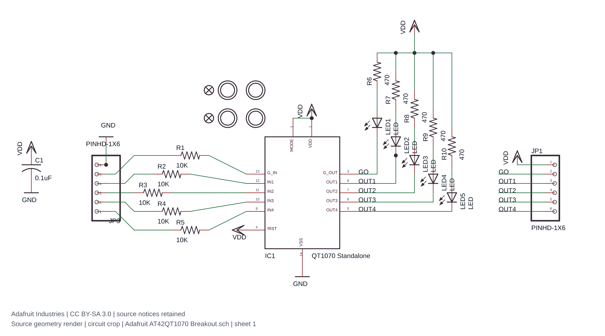

<details>
<summary>Complete system instruction and original first-turn evidence prompt</summary>

```text
You answer factual questions about the attached schematic and its extracted source evidence. Use only the supplied evidence. Identify connections as REFDES.PAD, where PAD is the physical package pad number. Distinguish schematic facts from design judgments. Do not invent missing components, specifications, measurements, or safety findings.
```

```text
Extracted native schematic evidence (not an electrical review):
{"scope": "this sheet only; physical package pad numbers, not symbol pin labels", "bom": [{"refdes": "C1", "value": "0.1uF"}, {"refdes": "FID1", "value": ""}, {"refdes": "FID2", "value": ""}, {"refdes": "IC1", "value": ""}, {"refdes": "JP1", "value": ""}, {"refdes": "JP3", "value": ""}, {"refdes": "LED1", "value": ""}, {"refdes": "LED2", "value": ""}, {"refdes": "LED3", "value": ""}, {"refdes": "LED4", "value": ""}, {"refdes": "LED5", "value": ""}, {"refdes": "R1", "value": "10K"}, {"refdes": "R10", "value": "470"}, {"refdes": "R2", "value": "10K"}, {"refdes": "R3", "value": "10K"}, {"refdes": "R4", "value": "10K"}, {"refdes": "R5", "value": "10K"}, {"refdes": "R6", "value": "470"}, {"refdes": "R7", "value": "470"}, {"refdes": "R8", "value": "470"}, {"refdes": "R9", "value": "470"}, {"refdes": "U$1", "value": ""}, {"refdes": "U$2", "value": ""}, {"refdes": "U$3", "value": ""}, {"refdes": "U$4", "value": ""}], "nets": {"GND": ["C1.2", "IC1.14", "JP3.6"], "GO": ["IC1.3", "JP1.2", "LED1.C"], "N$1": ["IC1.13", "R1.2"], "N$10": ["JP3.1", "R5.1"], "N$11": ["LED1.A", "R6.1"], "N$12": ["LED2.A", "R7.1"], "N$13": ["LED3.A", "R8.1"], "N$14": ["LED4.A", "R9.1"], "N$15": ["LED5.A", "R10.1"], "N$2": ["IC1.12", "R2.2"], "N$3": ["IC1.11", "R3.2"], "N$4": ["IC1.10", "R4.2"], "N$5": ["IC1.9", "R5.2"], "N$6": ["JP3.5", "R1.1"], "N$7": ["JP3.4", "R2.1"], "N$8": ["JP3.3", "R3.1"], "N$9": ["JP3.2", "R4.1"], "OUT1": ["IC1.8", "JP1.3", "LED2.C"], "OUT2": ["IC1.7", "JP1.4", "LED3.C"], "OUT3": ["IC1.6", "JP1.5", "LED4.C"], "OUT4": ["IC1.5", "JP1.6", "LED5.C"], "VDD": ["C1.1", "IC1.1", "IC1.2", "IC1.4", "JP1.1", "R10.2", "R6.2", "R7.2", "R8.2", "R9.2"]}}

What value is recorded for R1?
```

</details>

**User 1**

```text
What value is recorded for R1?
```

**Assistant 1 — simulated gold**

```text
R1 has value 10K in the source schematic.
```

**User 2**

```text
Which physical component pads connect to net GND on this sheet?
```

**Assistant 2 — simulated gold**

```text
On this sheet, GND connects C1.2, IC1.14, JP3.6.
```

**User 3**

```text
Trace C1.2: which other physical pads share its net on this sheet?
```

**Assistant 3 — simulated gold**

```text
C1.2 is on GND, together with IC1.14, JP3.6.
```

**User 4**

```text
What is the specified value of R10?
```

**Assistant 4 — simulated gold**

```text
R10 has value 470 in the source schematic.
```

**User 5**

```text
What value is R9999, and what does it connect to?
```

**Assistant 5 — simulated gold**

```text
There is no R9999 in the supplied sheet evidence. Its value and connections are not shown.
```

**User 6**

```text
What measured voltage was observed at C1.2 during a powered bench test?
```

**Assistant 6 — simulated gold**

```text
No bench measurement is supplied in this schematic or source evidence. I cannot infer a measured voltage.
```

## 16. adafruit/Adafruit-Stereo-Speaker-Bonnet-PCB

Conversation `real-9da716c8d03261bc-p1` · dataset split `train` · source commit `7ba780f5f5c00274d3eeb395f444534189f13a0d`.

[Original schematic](https://github.com/adafruit/Adafruit-Stereo-Speaker-Bonnet-PCB/blob/7ba780f5f5c00274d3eeb395f444534189f13a0d/Adafruit%20Speaker%20Bonnet%20rev%20D.sch) · [CC BY-SA 3.0 license](https://github.com/adafruit/Adafruit-Stereo-Speaker-Bonnet-PCB/blob/7ba780f5f5c00274d3eeb395f444534189f13a0d/license.txt)

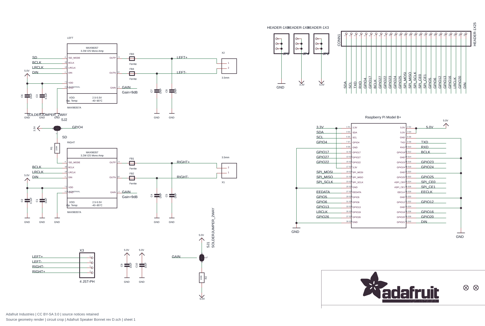

<details>
<summary>Complete system instruction and original first-turn evidence prompt</summary>

```text
You answer factual questions about the attached schematic and its extracted source evidence. Use only the supplied evidence. Identify connections as REFDES.PAD, where PAD is the physical package pad number. Distinguish schematic facts from design judgments. Do not invent missing components, specifications, measurements, or safety findings.
```

```text
Extracted native schematic evidence (not an electrical review):
{"scope": "this sheet only; physical package pad numbers, not symbol pin labels", "bom": [{"refdes": "C1", "value": "10uF"}, {"refdes": "C10", "value": "10uF"}, {"refdes": "C2", "value": "0.1uF"}, {"refdes": "C3", "value": "0.1uF"}, {"refdes": "C4", "value": "DNP"}, {"refdes": "C5", "value": "DNP"}, {"refdes": "C6", "value": "10uF"}, {"refdes": "C7", "value": "DNP"}, {"refdes": "C8", "value": "DNP"}, {"refdes": "C9", "value": "10uF"}, {"refdes": "CONN1", "value": ""}, {"refdes": "FB1", "value": "Ferrite"}, {"refdes": "FB2", "value": "Ferrite"}, {"refdes": "FB3", "value": "Ferrite"}, {"refdes": "FB4", "value": "Ferrite"}, {"refdes": "FID1", "value": ""}, {"refdes": "FID2", "value": ""}, {"refdes": "JP2", "value": ""}, {"refdes": "JP4", "value": ""}, {"refdes": "JP5", "value": ""}, {"refdes": "LEFT", "value": "MAX98357A"}, {"refdes": "R1", "value": "220K"}, {"refdes": "R2", "value": "100K"}, {"refdes": "RIGHT", "value": "MAX98357A"}, {"refdes": "RPI1", "value": "RASPBERRYPI_BPLUS_BONNET_THMSMT"}, {"refdes": "SJ1", "value": ""}, {"refdes": "SJ2", "value": ""}, {"refdes": "X1", "value": "3.5mm"}, {"refdes": "X2", "value": "3.5mm"}, {"refdes": "X3", "value": "4 JST-PH"}], "nets": {"3.3V": ["JP4.1", "JP4.2", "JP4.3", "RPI1.1", "RPI1.17", "RPI1.S1", "RPI1.S17", "SJ2.3"], "5.0V": ["C1.1", "C10.1", "C2.1", "C3.1", "C6.1", "C9.1", "JP2.1", "JP2.2", "JP2.3", "LEFT.7", "LEFT.8", "R2.2", "RIGHT.7", "RIGHT.8", "RPI1.2", "RPI1.4", "RPI1.S2", "RPI1.S4", "SJ1.1"], "BCLK": ["CONN1.7", "LEFT.16", "RIGHT.16", "RPI1.12", "RPI1.S12"], "DIN": ["CONN1.25", "LEFT.1", "RIGHT.1", "RPI1.40", "RPI1.S40"], "EECLK": ["RPI1.28", "RPI1.S28"], "EEDATA": ["RPI1.27", "RPI1.S27"], "GAIN": ["LEFT.2", "RIGHT.2", "SJ1.2"], "GND": ["C1.2", "C10.2", "C2.2", "C3.2", "C4.2", "C5.2", "C6.2", "C7.2", "C8.2", "C9.2", "JP5.1", "JP5.2", "JP5.3", "LEFT.11", "LEFT.15", "LEFT.3", "LEFT.THERMAL", "RIGHT.11", "RIGHT.15", "RIGHT.3", "RIGHT.THERMAL", "RPI1.14", "RPI1.20", "RPI1.25", "RPI1.30", "RPI1.34", "RPI1.39", "RPI1.6", "RPI1.9", "RPI1.S14", "RPI1.S20", "RPI1.S25", "RPI1.S30", "RPI1.S34", "RPI1.S39", "RPI1.S6", "RPI1.S9"], "GPIO12": ["CONN1.20", "RPI1.32", "RPI1.S32"], "GPIO13": ["CONN1.21", "RPI1.33", "RPI1.S33"], "GPIO16": ["CONN1.22", "RPI1.36", "RPI1.S36"], "GPIO17": ["CONN1.6", "RPI1.11", "RPI1.S11"], "GPIO20": ["CONN1.24", "RPI1.38", "RPI1.S38"], "GPIO22": ["CONN1.9", "RPI1.15", "RPI1.S15"], "GPIO23": ["CONN1.10", "RPI1.16", "RPI1.S16"], "GPIO24": ["CONN1.11", "RPI1.18", "RPI1.S18"], "GPIO25": ["CONN1.12", "RPI1.22", "RPI1.S22"], "GPIO26": ["RPI1.37", "RPI1.S37"], "GPIO27": ["CONN1.8", "RPI1.13", "RPI1.S13"], "GPIO4": ["CONN1.5", "RPI1.7", "RPI1.S7", "SJ2.1"], "GPIO5": ["CONN1.18", "RPI1.29", "RPI1.S29"], "GPIO6": ["CONN1.19", "RPI1.31", "RPI1.S31"], "LEFT+": ["C8.1", "FB3.2", "X2.1", "X3.1"], "LEFT-": ["C7.1", "FB4.2", "X2.2", "X3.2"], "LRCLK": ["CONN1.23", "LEFT.14", "RIGHT.14", "RPI1.35", "RPI1.S35"], "N$1": ["FB4.1", "LEFT.10"], "N$2": ["FB3.1", "LEFT.9"], "N$5": ["FB2.1", "RIGHT.10"], "N$6": ["FB1.1", "RIGHT.9"], "N$7": ["R2.1", "SJ1.3"], "RIGHT+": ["C5.1", "FB1.2", "X1.2", "X3.4"], "RIGHT-": ["C4.1", "FB2.2", "X1.1", "X3.3"], "RXD": ["CONN1.4", "RPI1.10", "RPI1.S10"], "SCL": ["CONN1.2", "RPI1.5", "RPI1.S5"], "SD": ["LEFT.4", "R1.2", "SJ2.2"], "SDA": ["CONN1.1", "RPI1.3", "RPI1.S3"], "SD_MODE": ["R1.1", "RIGHT.4"], "SPI_CE0": ["CONN1.16", "RPI1.24", "RPI1.S24"], "SPI_CE1": ["CONN1.17", "RPI1.26", "RPI1.S26"], "SPI_MISO": ["CONN1.14", "RPI1.21", "RPI1.S21"], "SPI_MOSI": ["CONN1.13", "RPI1.19", "RPI1.S19"], "SPI_SCLK": ["CONN1.15", "RPI1.23", "RPI1.S23"], "TXD": ["CONN1.3", "RPI1.8", "RPI1.S8"]}}

What value is recorded for R1?
```

</details>

**User 1**

```text
What value is recorded for R1?
```

**Assistant 1 — simulated gold**

```text
R1 has value 220K in the source schematic.
```

**User 2**

```text
Which physical component pads connect to net EECLK on this sheet?
```

**Assistant 2 — simulated gold**

```text
On this sheet, EECLK connects RPI1.28, RPI1.S28.
```

**User 3**

```text
Trace RPI1.28: which other physical pads share its net on this sheet?
```

**Assistant 3 — simulated gold**

```text
RPI1.28 is on EECLK, together with RPI1.S28.
```

**User 4**

```text
What is the specified value of R2?
```

**Assistant 4 — simulated gold**

```text
R2 has value 100K in the source schematic.
```

**User 5**

```text
What value is R9999, and what does it connect to?
```

**Assistant 5 — simulated gold**

```text
There is no R9999 in the supplied sheet evidence. Its value and connections are not shown.
```

**User 6**

```text
What measured voltage was observed at RPI1.28 during a powered bench test?
```

**Assistant 6 — simulated gold**

```text
No bench measurement is supplied in this schematic or source evidence. I cannot infer a measured voltage.
```

## 17. adafruit/Adafruit-Sunken-USB-Type-C-Breakout-PCB

Conversation `real-25a4901c57038e8d-p1` · dataset split `train` · source commit `4cb1207ddd6eae864f4410d110bac38072e9b895`.

[Original schematic](https://github.com/adafruit/Adafruit-Sunken-USB-Type-C-Breakout-PCB/blob/4cb1207ddd6eae864f4410d110bac38072e9b895/Adafruit%20Sunken%20USB%20Type%20C%20Breakout.sch) · [CC BY-SA 3.0 license](https://github.com/adafruit/Adafruit-Sunken-USB-Type-C-Breakout-PCB/blob/4cb1207ddd6eae864f4410d110bac38072e9b895/license.txt)

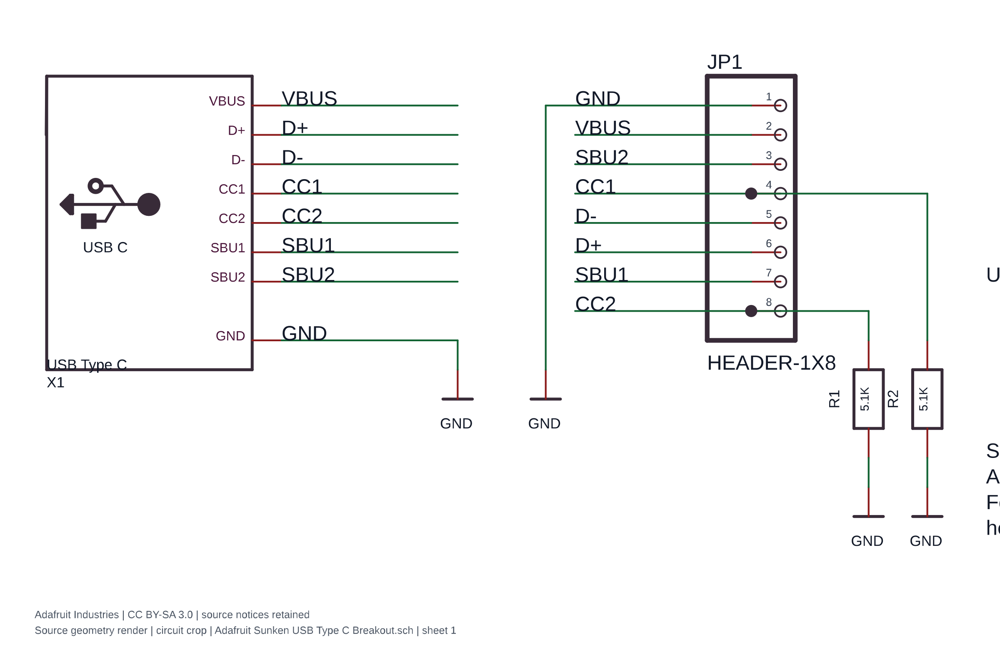

<details>
<summary>Complete system instruction and original first-turn evidence prompt</summary>

```text
You answer factual questions about the attached schematic and its extracted source evidence. Use only the supplied evidence. Identify connections as REFDES.PAD, where PAD is the physical package pad number. Distinguish schematic facts from design judgments. Do not invent missing components, specifications, measurements, or safety findings.
```

```text
Extracted native schematic evidence (not an electrical review):
{"scope": "this sheet only; physical package pad numbers, not symbol pin labels", "bom": [{"refdes": "FID1", "value": "FIDUCIAL_0.5MM"}, {"refdes": "FID2", "value": "FIDUCIAL_0.5MM"}, {"refdes": "JP1", "value": ""}, {"refdes": "R1", "value": "5.1K"}, {"refdes": "R2", "value": "5.1K"}, {"refdes": "U$1", "value": ""}, {"refdes": "U$2", "value": ""}, {"refdes": "X1", "value": "USB Type C"}], "nets": {"CC1": ["JP1.4", "R2.2", "X1.A5"], "CC2": ["JP1.8", "R1.2", "X1.B5"], "D+": ["JP1.6", "X1.A6", "X1.B6"], "D-": ["JP1.5", "X1.A7", "X1.B7"], "GND": ["JP1.1", "R1.1", "R2.1", "X1.A1B12", "X1.B1A12"], "SBU1": ["JP1.7", "X1.A8"], "SBU2": ["JP1.3", "X1.B8"], "VBUS": ["JP1.2", "X1.A4B9", "X1.B4A9"]}}

What value is recorded for R1?
```

</details>

**User 1**

```text
What value is recorded for R1?
```

**Assistant 1 — simulated gold**

```text
R1 has value 5.1K in the source schematic.
```

**User 2**

```text
Which physical component pads connect to net SBU1 on this sheet?
```

**Assistant 2 — simulated gold**

```text
On this sheet, SBU1 connects JP1.7, X1.A8.
```

**User 3**

```text
Trace JP1.7: which other physical pads share its net on this sheet?
```

**Assistant 3 — simulated gold**

```text
JP1.7 is on SBU1, together with X1.A8.
```

**User 4**

```text
What is the specified value of R2?
```

**Assistant 4 — simulated gold**

```text
R2 has value 5.1K in the source schematic.
```

**User 5**

```text
What value is R9999, and what does it connect to?
```

**Assistant 5 — simulated gold**

```text
There is no R9999 in the supplied sheet evidence. Its value and connections are not shown.
```

**User 6**

```text
What measured voltage was observed at JP1.7 during a powered bench test?
```

**Assistant 6 — simulated gold**

```text
No bench measurement is supplied in this schematic or source evidence. I cannot infer a measured voltage.
```

## 18. adafruit/Adafruit-Switchable-USB-Type-A-to-C-Breakout-Board-PCB

Conversation `real-84892a15b4476b61-p1` · dataset split `test` · source commit `1566b53c2cd5469be964c5f8bf6cf9d399ec7730`.

[Original schematic](https://github.com/adafruit/Adafruit-Switchable-USB-Type-A-to-C-Breakout-Board-PCB/blob/1566b53c2cd5469be964c5f8bf6cf9d399ec7730/Adafruit%20Switchable%20USB%20Type%20A%20to%20C%20Breakout%20Board.sch) · [CC BY-SA 3.0 license](https://github.com/adafruit/Adafruit-Switchable-USB-Type-A-to-C-Breakout-Board-PCB/blob/1566b53c2cd5469be964c5f8bf6cf9d399ec7730/license.txt)

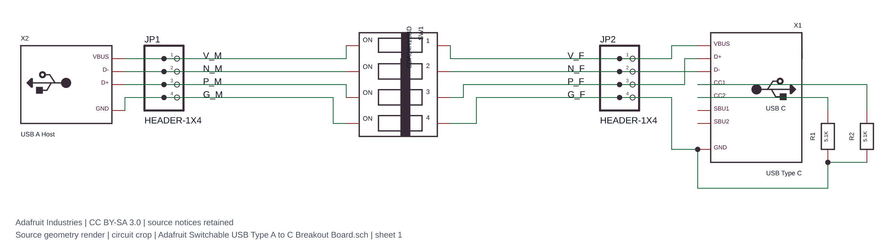

<details>
<summary>Complete system instruction and original first-turn evidence prompt</summary>

```text
You answer factual questions about the attached schematic and its extracted source evidence. Use only the supplied evidence. Identify connections as REFDES.PAD, where PAD is the physical package pad number. Distinguish schematic facts from design judgments. Do not invent missing components, specifications, measurements, or safety findings.
```

```text
Extracted native schematic evidence (not an electrical review):
{"scope": "this sheet only; physical package pad numbers, not symbol pin labels", "bom": [{"refdes": "FID1", "value": "FIDUCIAL_1MM"}, {"refdes": "FID2", "value": "FIDUCIAL_1MM"}, {"refdes": "JP1", "value": ""}, {"refdes": "JP2", "value": ""}, {"refdes": "R1", "value": "5.1K"}, {"refdes": "R2", "value": "5.1K"}, {"refdes": "SW1", "value": "SDA04H1SBD"}, {"refdes": "U$1", "value": ""}, {"refdes": "U$2", "value": ""}, {"refdes": "U$3", "value": ""}, {"refdes": "U$4", "value": ""}, {"refdes": "X1", "value": "USB Type C"}, {"refdes": "X2", "value": "USB A Host"}], "nets": {"G_F": ["JP2.4", "R1.1", "R2.1", "SW1.1ON", "X1.A1B12", "X1.B1A12"], "G_M": ["JP1.4", "SW1.1OFF", "X2.GND"], "N$3": ["R1.2", "X1.B5"], "N$4": ["R2.2", "X1.A5"], "N_F": ["JP2.2", "SW1.3ON", "X1.A7", "X1.B7"], "N_M": ["JP1.2", "SW1.3OFF", "X2.D-"], "P_F": ["JP2.3", "SW1.2ON", "X1.A6", "X1.B6"], "P_M": ["JP1.3", "SW1.2OFF", "X2.D+"], "V_F": ["JP2.1", "SW1.4ON", "X1.A4B9", "X1.B4A9"], "V_M": ["JP1.1", "SW1.4OFF", "X2.VBUS"]}}

What value is recorded for R1?
```

</details>

**User 1**

```text
What value is recorded for R1?
```

**Assistant 1 — simulated gold**

```text
R1 has value 5.1K in the source schematic.
```

**User 2**

```text
Which physical component pads connect to net G_M on this sheet?
```

**Assistant 2 — simulated gold**

```text
On this sheet, G_M connects JP1.4, SW1.1OFF, X2.GND.
```

**User 3**

```text
Trace JP1.4: which other physical pads share its net on this sheet?
```

**Assistant 3 — simulated gold**

```text
JP1.4 is on G_M, together with SW1.1OFF, X2.GND.
```

**User 4**

```text
What is the specified value of R2?
```

**Assistant 4 — simulated gold**

```text
R2 has value 5.1K in the source schematic.
```

**User 5**

```text
What value is R9999, and what does it connect to?
```

**Assistant 5 — simulated gold**

```text
There is no R9999 in the supplied sheet evidence. Its value and connections are not shown.
```

**User 6**

```text
What measured voltage was observed at JP1.4 during a powered bench test?
```

**Assistant 6 — simulated gold**

```text
No bench measurement is supplied in this schematic or source evidence. I cannot infer a measured voltage.
```

## 19. adafruit/Adafruit-TB6612-Motor-Driver-Breakout-PCB

Conversation `real-4c8976970f2cafd1-p1` · dataset split `train` · source commit `514d5ded1aade108d0698d0e718a92c22ff5496f`.

[Original schematic](https://github.com/adafruit/Adafruit-TB6612-Motor-Driver-Breakout-PCB/blob/514d5ded1aade108d0698d0e718a92c22ff5496f/Adafruit%20TB6612.sch) · [CC BY-SA 3.0 license](https://github.com/adafruit/Adafruit-TB6612-Motor-Driver-Breakout-PCB/blob/514d5ded1aade108d0698d0e718a92c22ff5496f/license.txt)

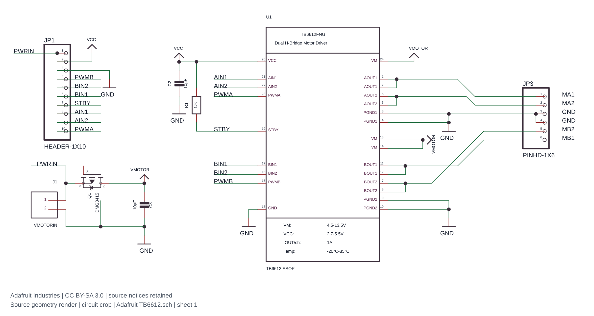

<details>
<summary>Complete system instruction and original first-turn evidence prompt</summary>

```text
You answer factual questions about the attached schematic and its extracted source evidence. Use only the supplied evidence. Identify connections as REFDES.PAD, where PAD is the physical package pad number. Distinguish schematic facts from design judgments. Do not invent missing components, specifications, measurements, or safety findings.
```

```text
Extracted native schematic evidence (not an electrical review):
{"scope": "this sheet only; physical package pad numbers, not symbol pin labels", "bom": [{"refdes": "C2", "value": "10\u00b5F"}, {"refdes": "C3", "value": "10\u00b5F"}, {"refdes": "FID1", "value": ""}, {"refdes": "FID2", "value": ""}, {"refdes": "J1", "value": "VMOTORIN"}, {"refdes": "JP1", "value": ""}, {"refdes": "JP3", "value": ""}, {"refdes": "Q1", "value": "DMG3415"}, {"refdes": "R1", "value": "10K"}, {"refdes": "U$13", "value": "MOUNTINGHOLE2.5"}, {"refdes": "U$14", "value": "MOUNTINGHOLE2.5"}, {"refdes": "U1", "value": "TB6612 SSOP"}], "nets": {"AIN1": ["JP1.8", "U1.21"], "AIN2": ["JP1.9", "U1.22"], "BIN1": ["JP1.6", "U1.17"], "BIN2": ["JP1.5", "U1.16"], "GND": ["C2.2", "C3.2", "J1.2", "JP1.3", "JP3.3", "JP3.4", "Q1.1", "U1.10", "U1.18", "U1.3", "U1.4", "U1.9"], "MA1": ["JP3.1", "U1.1", "U1.2"], "MA2": ["JP3.2", "U1.5", "U1.6"], "MB1": ["JP3.6", "U1.11", "U1.12"], "MB2": ["JP3.5", "U1.7", "U1.8"], "PWMA": ["JP1.10", "U1.23"], "PWMB": ["JP1.4", "U1.15"], "PWRIN": ["J1.1", "JP1.1", "Q1.3"], "STBY": ["JP1.7", "R1.1", "U1.19"], "VCC": ["C2.1", "JP1.2", "R1.2", "U1.20"], "VMOTOR": ["C3.1", "Q1.2", "U1.13", "U1.14", "U1.24"]}}

What value is recorded for R1?
```

</details>

**User 1**

```text
What value is recorded for R1?
```

**Assistant 1 — simulated gold**

```text
R1 has value 10K in the source schematic.
```

**User 2**

```text
Which physical component pads connect to net AIN1 on this sheet?
```

**Assistant 2 — simulated gold**

```text
On this sheet, AIN1 connects JP1.8, U1.21.
```

**User 3**

```text
Trace JP1.8: which other physical pads share its net on this sheet?
```

**Assistant 3 — simulated gold**

```text
JP1.8 is on AIN1, together with U1.21.
```

**User 4**

```text
What is the specified value of C2?
```

**Assistant 4 — simulated gold**

```text
C2 has value 10µF in the source schematic.
```

**User 5**

```text
What value is R9999, and what does it connect to?
```

**Assistant 5 — simulated gold**

```text
There is no R9999 in the supplied sheet evidence. Its value and connections are not shown.
```

**User 6**

```text
What measured voltage was observed at JP1.8 during a powered bench test?
```

**Assistant 6 — simulated gold**

```text
No bench measurement is supplied in this schematic or source evidence. I cannot infer a measured voltage.
```

## 20. adafruit/Adafruit-TCA4307-PCB

Conversation `real-f7727f5ab74d466f-p1` · dataset split `train` · source commit `5b71f3b8aa3b892fa96e2a7e8e102f69f4f75ee1`.

[Original schematic](https://github.com/adafruit/Adafruit-TCA4307-PCB/blob/5b71f3b8aa3b892fa96e2a7e8e102f69f4f75ee1/Adafruit%20TCA4307.sch) · [CC BY-SA 3.0 license](https://github.com/adafruit/Adafruit-TCA4307-PCB/blob/5b71f3b8aa3b892fa96e2a7e8e102f69f4f75ee1/license.txt)

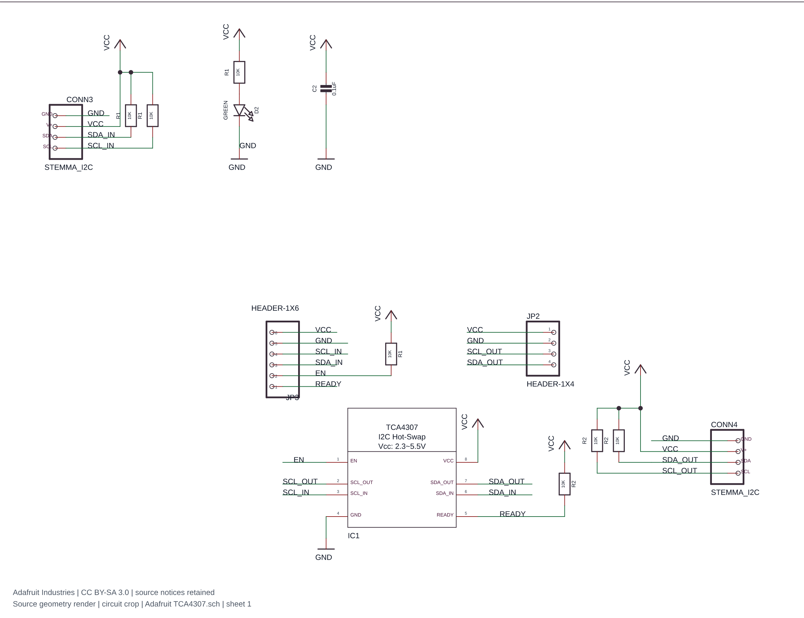

<details>
<summary>Complete system instruction and original first-turn evidence prompt</summary>

```text
You answer factual questions about the attached schematic and its extracted source evidence. Use only the supplied evidence. Identify connections as REFDES.PAD, where PAD is the physical package pad number. Distinguish schematic facts from design judgments. Do not invent missing components, specifications, measurements, or safety findings.
```

```text
Extracted native schematic evidence (not an electrical review):
{"scope": "this sheet only; physical package pad numbers, not symbol pin labels", "bom": [{"refdes": "C2", "value": "0.1uF"}, {"refdes": "CONN3", "value": ""}, {"refdes": "CONN4", "value": ""}, {"refdes": "D2", "value": "GREEN"}, {"refdes": "FID3", "value": ""}, {"refdes": "FID4", "value": ""}, {"refdes": "IC1", "value": ""}, {"refdes": "JP2", "value": ""}, {"refdes": "JP3", "value": ""}, {"refdes": "R1", "value": "10K"}, {"refdes": "R2", "value": "10K"}, {"refdes": "U$1", "value": ""}, {"refdes": "U$17", "value": ""}, {"refdes": "U$19", "value": ""}, {"refdes": "U$21", "value": ""}], "nets": {"EN": ["IC1.1", "JP3.2", "R1.7"], "GND": ["C2.2", "CONN3.1", "CONN4.1", "D2.C", "IC1.4", "JP2.2", "JP3.5"], "N$1": ["D2.A", "R1.1"], "READY": ["IC1.5", "JP3.1", "R2.8"], "SCL_IN": ["CONN3.4", "IC1.3", "JP3.4", "R1.4"], "SCL_OUT": ["CONN4.4", "IC1.2", "JP2.3", "R2.3"], "SDA_IN": ["CONN3.3", "IC1.6", "JP3.3", "R1.3"], "SDA_OUT": ["CONN4.3", "IC1.7", "JP2.4", "R2.2"], "VCC": ["C2.1", "CONN3.2", "CONN4.2", "IC1.8", "JP2.1", "JP3.6", "R1.2", "R1.5", "R1.6", "R1.8", "R2.1", "R2.6", "R2.7"]}}

What value is recorded for R1?
```

</details>

**User 1**

```text
What value is recorded for R1?
```

**Assistant 1 — simulated gold**

```text
R1 has value 10K in the source schematic.
```

**User 2**

```text
Which physical component pads connect to net EN on this sheet?
```

**Assistant 2 — simulated gold**

```text
On this sheet, EN connects IC1.1, JP3.2, R1.7.
```

**User 3**

```text
Trace IC1.1: which other physical pads share its net on this sheet?
```

**Assistant 3 — simulated gold**

```text
IC1.1 is on EN, together with JP3.2, R1.7.
```

**User 4**

```text
What is the specified value of R2?
```

**Assistant 4 — simulated gold**

```text
R2 has value 10K in the source schematic.
```

**User 5**

```text
What value is R9999, and what does it connect to?
```

**Assistant 5 — simulated gold**

```text
There is no R9999 in the supplied sheet evidence. Its value and connections are not shown.
```

**User 6**

```text
What measured voltage was observed at IC1.1 during a powered bench test?
```

**Assistant 6 — simulated gold**

```text
No bench measurement is supplied in this schematic or source evidence. I cannot infer a measured voltage.
```

## 21. adafruit/Adafruit-TCA8418-PCB

Conversation `real-f597df58487a0f98-p1` · dataset split `train` · source commit `e64ed84dd0fe144759e9d8ceb556d54c9df4e8c0`.

[Original schematic](https://github.com/adafruit/Adafruit-TCA8418-PCB/blob/e64ed84dd0fe144759e9d8ceb556d54c9df4e8c0/Adafruit%20TCA8418.sch) · [CC BY-SA 3.0 license](https://github.com/adafruit/Adafruit-TCA8418-PCB/blob/e64ed84dd0fe144759e9d8ceb556d54c9df4e8c0/license.txt)

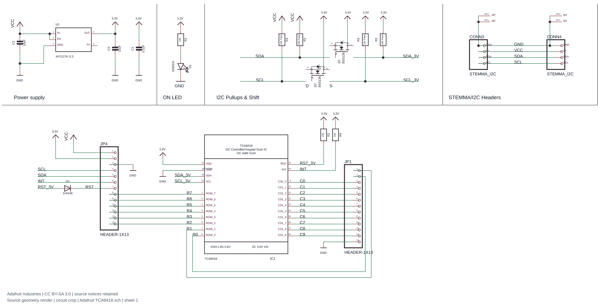

<details>
<summary>Complete system instruction and original first-turn evidence prompt</summary>

```text
You answer factual questions about the attached schematic and its extracted source evidence. Use only the supplied evidence. Identify connections as REFDES.PAD, where PAD is the physical package pad number. Distinguish schematic facts from design judgments. Do not invent missing components, specifications, measurements, or safety findings.
```

```text
Extracted native schematic evidence (not an electrical review):
{"scope": "this sheet only; physical package pad numbers, not symbol pin labels", "bom": [{"refdes": "C1", "value": "0.1uF"}, {"refdes": "C2", "value": "10uF"}, {"refdes": "C3", "value": "10uF"}, {"refdes": "CONN3", "value": ""}, {"refdes": "CONN4", "value": ""}, {"refdes": "D1", "value": "GREEN"}, {"refdes": "D2", "value": "1n4148"}, {"refdes": "FID3", "value": ""}, {"refdes": "FID4", "value": ""}, {"refdes": "IC1", "value": ""}, {"refdes": "JP1", "value": ""}, {"refdes": "JP4", "value": ""}, {"refdes": "Q2", "value": "BSS138"}, {"refdes": "R1", "value": "10K"}, {"refdes": "R2", "value": "10K"}, {"refdes": "R3", "value": "10K Pack"}, {"refdes": "R4", "value": "10K"}, {"refdes": "U$1", "value": ""}, {"refdes": "U$17", "value": ""}, {"refdes": "U2", "value": "AP2127K-3.3"}], "nets": {"3.3V": ["C1.1", "C3.1", "IC1.21", "JP4.2", "Q2.2", "Q2.5", "R1.1", "R2.1", "R3.2", "R3.4", "R4.1", "U2.5"], "C0": ["IC1.9", "JP1.3"], "C1": ["IC1.10", "JP1.4"], "C2": ["IC1.11", "JP1.5"], "C3": ["IC1.12", "JP1.6"], "C4": ["IC1.13", "JP1.7"], "C5": ["IC1.14", "JP1.8"], "C6": ["IC1.15", "JP1.9"], "C7": ["IC1.16", "JP1.10"], "C8": ["IC1.17", "JP1.11"], "C9": ["IC1.18", "JP1.12"], "GND": ["C1.2", "C2.2", "C3.2", "CONN3.1", "CONN3.MT1", "CONN3.MT2", "CONN4.1", "CONN4.MT1", "CONN4.MT2", "D1.C", "IC1.19", "IC1.THERM", "JP1.13", "JP4.3", "U2.2"], "INT": ["IC1.24", "JP4.6", "R4.2"], "N$1": ["D1.A", "R1.2"], "R0": ["IC1.8", "JP1.2"], "R1": ["IC1.7", "JP1.1"], "R2": ["IC1.6", "JP4.13"], "R3": ["IC1.5", "JP4.12"], "R4": ["IC1.4", "JP4.11"], "R5": ["IC1.3", "JP4.10"], "R6": ["IC1.2", "JP4.9"], "R7": ["IC1.1", "JP4.8"], "RST": ["D2.C", "JP4.7"], "RST_3V": ["D2.A", "IC1.20", "R2.2"], "SCL": ["CONN3.4", "CONN4.4", "JP4.4", "Q2.6", "R3.8"], "SCL_3V": ["IC1.23", "Q2.1", "R3.7"], "SDA": ["CONN3.3", "CONN4.3", "JP4.5", "Q2.3", "R3.6"], "SDA_3V": ["IC1.22", "Q2.4", "R3.5"], "VCC": ["C2.1", "CONN3.2", "CONN4.2", "JP4.1", "R3.1", "R3.3", "U2.1", "U2.3"]}}

What value is recorded for R1?
```

</details>

**User 1**

```text
What value is recorded for R1?
```

**Assistant 1 — simulated gold**

```text
R1 has value 10K in the source schematic.
```

**User 2**

```text
Which physical component pads connect to net C0 on this sheet?
```

**Assistant 2 — simulated gold**

```text
On this sheet, C0 connects IC1.9, JP1.3.
```

**User 3**

```text
Trace IC1.9: which other physical pads share its net on this sheet?
```

**Assistant 3 — simulated gold**

```text
IC1.9 is on C0, together with JP1.3.
```

**User 4**

```text
What is the specified value of R2?
```

**Assistant 4 — simulated gold**

```text
R2 has value 10K in the source schematic.
```

**User 5**

```text
What value is R9999, and what does it connect to?
```

**Assistant 5 — simulated gold**

```text
There is no R9999 in the supplied sheet evidence. Its value and connections are not shown.
```

**User 6**

```text
What measured voltage was observed at IC1.9 during a powered bench test?
```

**Assistant 6 — simulated gold**

```text
No bench measurement is supplied in this schematic or source evidence. I cannot infer a measured voltage.
```

## 22. adafruit/Adafruit-TCA9548A-I2C-Multiplexer-PCB

Conversation `real-45e6787c46112056-p1` · dataset split `test` · source commit `c5bdfe4c8e860cee7400539d6e45a235da7afcd2`.

[Original schematic](https://github.com/adafruit/Adafruit-TCA9548A-I2C-Multiplexer-PCB/blob/c5bdfe4c8e860cee7400539d6e45a235da7afcd2/Adafruit%20TCA9548A.sch) · [CC BY-SA 3.0 license](https://github.com/adafruit/Adafruit-TCA9548A-I2C-Multiplexer-PCB/blob/c5bdfe4c8e860cee7400539d6e45a235da7afcd2/license.txt)

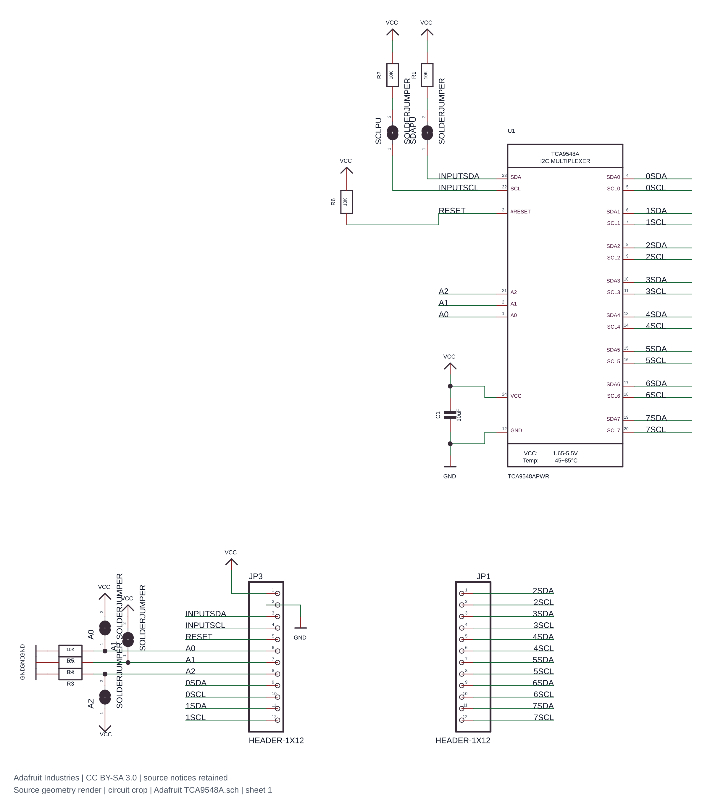

<details>
<summary>Complete system instruction and original first-turn evidence prompt</summary>

```text
You answer factual questions about the attached schematic and its extracted source evidence. Use only the supplied evidence. Identify connections as REFDES.PAD, where PAD is the physical package pad number. Distinguish schematic facts from design judgments. Do not invent missing components, specifications, measurements, or safety findings.
```

```text
Extracted native schematic evidence (not an electrical review):
{"scope": "this sheet only; physical package pad numbers, not symbol pin labels", "bom": [{"refdes": "A0", "value": ""}, {"refdes": "A1", "value": ""}, {"refdes": "A2", "value": ""}, {"refdes": "C1", "value": "10uF"}, {"refdes": "FID1", "value": ""}, {"refdes": "FID3", "value": ""}, {"refdes": "JP1", "value": ""}, {"refdes": "JP3", "value": ""}, {"refdes": "R1", "value": "10K"}, {"refdes": "R2", "value": "10K"}, {"refdes": "R3", "value": "10K"}, {"refdes": "R4", "value": "10K"}, {"refdes": "R5", "value": "10K"}, {"refdes": "R6", "value": "10K"}, {"refdes": "SCLPU", "value": ""}, {"refdes": "SDAPU", "value": ""}, {"refdes": "U$4", "value": ""}, {"refdes": "U$5", "value": ""}, {"refdes": "U1", "value": " TCA9548APWR"}], "nets": {"0SCL": ["JP3.10", "U1.5"], "0SDA": ["JP3.9", "U1.4"], "1SCL": ["JP3.12", "U1.7"], "1SDA": ["JP3.11", "U1.6"], "2SCL": ["JP1.2", "U1.9"], "2SDA": ["JP1.1", "U1.8"], "3SCL": ["JP1.4", "U1.11"], "3SDA": ["JP1.3", "U1.10"], "4SCL": ["JP1.6", "U1.14"], "4SDA": ["JP1.5", "U1.13"], "5SCL": ["JP1.8", "U1.16"], "5SDA": ["JP1.7", "U1.15"], "6SCL": ["JP1.10", "U1.18"], "6SDA": ["JP1.9", "U1.17"], "7SCL": ["JP1.12", "U1.20"], "7SDA": ["JP1.11", "U1.19"], "A0": ["A0.1", "JP3.6", "R5.1", "U1.1"], "A1": ["A1.1", "JP3.7", "R4.1", "U1.2"], "A2": ["A2.2", "JP3.8", "R3.1", "U1.21"], "GND": ["C1.2", "JP3.2", "R3.2", "R4.2", "R5.2", "U1.12"], "INPUTSCL": ["JP3.4", "SCLPU.1", "U1.22"], "INPUTSDA": ["JP3.3", "SDAPU.1", "U1.23"], "N$3": ["R2.1", "SCLPU.2"], "N$4": ["R1.1", "SDAPU.2"], "RESET": ["JP3.5", "R6.1", "U1.3"], "VCC": ["A0.2", "A1.2", "A2.1", "C1.1", "JP3.1", "R1.2", "R2.2", "R6.2", "U1.24"]}}

What value is recorded for R1?
```

</details>

**User 1**

```text
What value is recorded for R1?
```

**Assistant 1 — simulated gold**

```text
R1 has value 10K in the source schematic.
```

**User 2**

```text
Which physical component pads connect to net 0SCL on this sheet?
```

**Assistant 2 — simulated gold**

```text
On this sheet, 0SCL connects JP3.10, U1.5.
```

**User 3**

```text
Trace JP3.10: which other physical pads share its net on this sheet?
```

**Assistant 3 — simulated gold**

```text
JP3.10 is on 0SCL, together with U1.5.
```

**User 4**

```text
What is the specified value of R2?
```

**Assistant 4 — simulated gold**

```text
R2 has value 10K in the source schematic.
```

**User 5**

```text
What value is R9999, and what does it connect to?
```

**Assistant 5 — simulated gold**

```text
There is no R9999 in the supplied sheet evidence. Its value and connections are not shown.
```

**User 6**

```text
What measured voltage was observed at JP3.10 during a powered bench test?
```

**Assistant 6 — simulated gold**

```text
No bench measurement is supplied in this schematic or source evidence. I cannot infer a measured voltage.
```

## 23. adafruit/Adafruit-TCS3430-Ambient-Tri-Stimulus-Color-Sensor-PCB

Conversation `real-ca5f1220478254f3-p1` · dataset split `train` · source commit `66a56ff8cdb46158dbb87cbe5cc557d7ff14b6e1`.

[Original schematic](https://github.com/adafruit/Adafruit-TCS3430-Ambient-Tri-Stimulus-Color-Sensor-PCB/blob/66a56ff8cdb46158dbb87cbe5cc557d7ff14b6e1/Adafruit%20TCS3430%20Ambient%20Tri-Stimulus%20Color%20Sensor.sch) · [CC BY-SA 3.0 license](https://github.com/adafruit/Adafruit-TCS3430-Ambient-Tri-Stimulus-Color-Sensor-PCB/blob/66a56ff8cdb46158dbb87cbe5cc557d7ff14b6e1/license.txt)

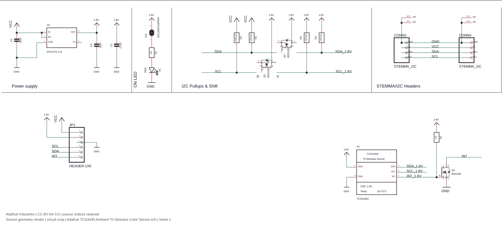

<details>
<summary>Complete system instruction and original first-turn evidence prompt</summary>

```text
You answer factual questions about the attached schematic and its extracted source evidence. Use only the supplied evidence. Identify connections as REFDES.PAD, where PAD is the physical package pad number. Distinguish schematic facts from design judgments. Do not invent missing components, specifications, measurements, or safety findings.
```

```text
Extracted native schematic evidence (not an electrical review):
{"scope": "this sheet only; physical package pad numbers, not symbol pin labels", "bom": [{"refdes": "C1", "value": "0.1uF"}, {"refdes": "C2", "value": "10uF"}, {"refdes": "C3", "value": "10uF"}, {"refdes": "CONN3", "value": ""}, {"refdes": "CONN4", "value": ""}, {"refdes": "D1", "value": "RED"}, {"refdes": "FID3", "value": "FIDUCIAL_0.5MM"}, {"refdes": "FID4", "value": "FIDUCIAL_0.5MM"}, {"refdes": "JP1", "value": ""}, {"refdes": "Q1", "value": "BSS138"}, {"refdes": "Q2", "value": "BSS138"}, {"refdes": "R1", "value": "10K"}, {"refdes": "R2", "value": "10K"}, {"refdes": "R3", "value": "10KPack"}, {"refdes": "SJ1", "value": ""}, {"refdes": "U$1", "value": "MOUNTINGHOLE2.5"}, {"refdes": "U$17", "value": "MOUNTINGHOLE2.5"}, {"refdes": "U$20", "value": "MOUNTINGHOLE2.5"}, {"refdes": "U$9", "value": "MOUNTINGHOLE2.5"}, {"refdes": "U2", "value": "AP2127K-1.8"}, {"refdes": "X1", "value": ""}], "nets": {"1.8V": ["C1.1", "C3.1", "JP1.2", "Q2.2", "Q2.5", "R2.1", "R3.2", "R3.4", "SJ1.2", "U2.5", "X1.1"], "GND": ["C1.2", "C2.2", "C3.2", "CONN3.1", "CONN3.MT1", "CONN3.MT2", "CONN4.1", "CONN4.MT1", "CONN4.MT2", "D1.C", "JP1.3", "Q1.4", "U2.2", "X1.7", "X1.8"], "INT": ["JP1.6", "Q1.3"], "INT_1.8V": ["Q1.5", "R2.2", "X1.4"], "N$1": ["D1.A", "R1.2"], "N$2": ["R1.1", "SJ1.1"], "SCL": ["CONN3.4", "CONN4.4", "JP1.4", "Q2.6", "R3.8"], "SCL_1.8V": ["Q2.1", "R3.7", "X1.3"], "SDA": ["CONN3.3", "CONN4.3", "JP1.5", "Q2.3", "R3.6"], "SDA_1.8V": ["Q2.4", "R3.5", "X1.2"], "VCC": ["C2.1", "CONN3.2", "CONN4.2", "JP1.1", "R3.1", "R3.3", "U2.1", "U2.3"]}}

What value is recorded for R1?
```

</details>

**User 1**

```text
What value is recorded for R1?
```

**Assistant 1 — simulated gold**

```text
R1 has value 10K in the source schematic.
```

**User 2**

```text
Which physical component pads connect to net INT on this sheet?
```

**Assistant 2 — simulated gold**

```text
On this sheet, INT connects JP1.6, Q1.3.
```

**User 3**

```text
Trace JP1.6: which other physical pads share its net on this sheet?
```

**Assistant 3 — simulated gold**

```text
JP1.6 is on INT, together with Q1.3.
```

**User 4**

```text
What is the specified value of R2?
```

**Assistant 4 — simulated gold**

```text
R2 has value 10K in the source schematic.
```

**User 5**

```text
What value is R9999, and what does it connect to?
```

**Assistant 5 — simulated gold**

```text
There is no R9999 in the supplied sheet evidence. Its value and connections are not shown.
```

**User 6**

```text
What measured voltage was observed at JP1.6 during a powered bench test?
```

**Assistant 6 — simulated gold**

```text
No bench measurement is supplied in this schematic or source evidence. I cannot infer a measured voltage.
```

## 24. adafruit/Adafruit-TCS3448-14-Channel-Light-Color-Sensor-Breakout-PCB

Conversation `real-bda7b4b6cfae0cb4-p1` · dataset split `test` · source commit `ff0a1a5f90e632625c85892d8cf30d9bbd2179b3`.

[Original schematic](https://github.com/adafruit/Adafruit-TCS3448-14-Channel-Light-Color-Sensor-Breakout-PCB/blob/ff0a1a5f90e632625c85892d8cf30d9bbd2179b3/Adafruit%20TCS3448%2014-Channel%20Light%20Color%20Sensor%20Breakout%20rev%20E.sch) · [CC BY-SA 3.0 license](https://github.com/adafruit/Adafruit-TCS3448-14-Channel-Light-Color-Sensor-Breakout-PCB/blob/ff0a1a5f90e632625c85892d8cf30d9bbd2179b3/license.txt)

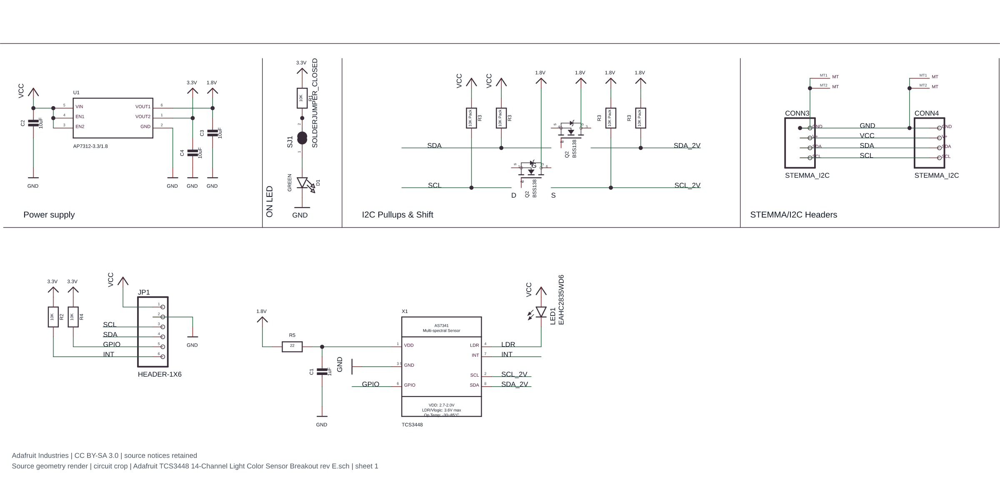

<details>
<summary>Complete system instruction and original first-turn evidence prompt</summary>

```text
You answer factual questions about the attached schematic and its extracted source evidence. Use only the supplied evidence. Identify connections as REFDES.PAD, where PAD is the physical package pad number. Distinguish schematic facts from design judgments. Do not invent missing components, specifications, measurements, or safety findings.
```

```text
Extracted native schematic evidence (not an electrical review):
{"scope": "this sheet only; physical package pad numbers, not symbol pin labels", "bom": [{"refdes": "C1", "value": "1uF"}, {"refdes": "C2", "value": "10uF"}, {"refdes": "C3", "value": "10uF"}, {"refdes": "C4", "value": "10uF"}, {"refdes": "CONN3", "value": ""}, {"refdes": "CONN4", "value": ""}, {"refdes": "D1", "value": "GREEN"}, {"refdes": "FID3", "value": "FIDUCIAL_0.5MM"}, {"refdes": "FID4", "value": "FIDUCIAL_0.5MM"}, {"refdes": "JP1", "value": ""}, {"refdes": "LED1", "value": "EAHC2835WD6"}, {"refdes": "Q2", "value": "BSS138"}, {"refdes": "R1", "value": "10K"}, {"refdes": "R2", "value": "10K"}, {"refdes": "R3", "value": "10K Pack"}, {"refdes": "R4", "value": "10K"}, {"refdes": "R5", "value": "22"}, {"refdes": "SJ1", "value": ""}, {"refdes": "U$1", "value": ""}, {"refdes": "U$17", "value": ""}, {"refdes": "U$19", "value": ""}, {"refdes": "U$21", "value": ""}, {"refdes": "U1", "value": "AP7312-3.3/1.8"}, {"refdes": "X1", "value": "TCS3448"}], "nets": {"1.8V": ["C3.1", "Q2.2", "Q2.5", "R3.2", "R3.4", "R5.1", "U1.6"], "3.3V": ["C4.1", "R1.1", "R2.1", "R4.1", "U1.1"], "GND": ["C1.2", "C2.2", "C3.2", "C4.2", "CONN3.1", "CONN3.MT1", "CONN3.MT2", "CONN4.1", "CONN4.MT1", "CONN4.MT2", "D1.C", "JP1.2", "U1.2", "X1.3", "X1.5"], "GPIO": ["JP1.5", "R4.2", "X1.6"], "INT": ["JP1.6", "R2.2", "X1.7"], "LDR": ["LED1.C", "X1.4"], "N$1": ["D1.A", "SJ1.1"], "N$2": ["R1.2", "SJ1.2"], "N$3": ["C1.1", "R5.2", "X1.1"], "SCL": ["CONN3.4", "CONN4.4", "JP1.3", "Q2.6", "R3.8"], "SCL_2V": ["Q2.1", "R3.7", "X1.2"], "SDA": ["CONN3.3", "CONN4.3", "JP1.4", "Q2.3", "R3.6"], "SDA_2V": ["Q2.4", "R3.5", "X1.8"], "VCC": ["C2.1", "CONN3.2", "CONN4.2", "JP1.1", "LED1.A", "R3.1", "R3.3", "U1.3", "U1.4", "U1.5"]}}

What value is recorded for R1?
```

</details>

**User 1**

```text
What value is recorded for R1?
```

**Assistant 1 — simulated gold**

```text
R1 has value 10K in the source schematic.
```

**User 2**

```text
Which physical component pads connect to net LDR on this sheet?
```

**Assistant 2 — simulated gold**

```text
On this sheet, LDR connects LED1.C, X1.4.
```

**User 3**

```text
Trace LED1.C: which other physical pads share its net on this sheet?
```

**Assistant 3 — simulated gold**

```text
LED1.C is on LDR, together with X1.4.
```

**User 4**

```text
What is the specified value of R2?
```

**Assistant 4 — simulated gold**

```text
R2 has value 10K in the source schematic.
```

**User 5**

```text
What value is R9999, and what does it connect to?
```

**Assistant 5 — simulated gold**

```text
There is no R9999 in the supplied sheet evidence. Its value and connections are not shown.
```

**User 6**

```text
What measured voltage was observed at LED1.C during a powered bench test?
```

**Assistant 6 — simulated gold**

```text
No bench measurement is supplied in this schematic or source evidence. I cannot infer a measured voltage.
```

## 25. adafruit/Adafruit-TCS34725-Color-Sensor-Breakout-PCB

Conversation `real-fac3ab5c362b8f47-p1` · dataset split `train` · source commit `a430372ce3aa9ca0184bd7354f9417ea0dc518a6`.

[Original schematic](https://github.com/adafruit/Adafruit-TCS34725-Color-Sensor-Breakout-PCB/blob/a430372ce3aa9ca0184bd7354f9417ea0dc518a6/Adafruit%20TCS34725.sch) · [CC BY-SA 3.0 license](https://github.com/adafruit/Adafruit-TCS34725-Color-Sensor-Breakout-PCB/blob/a430372ce3aa9ca0184bd7354f9417ea0dc518a6/license.txt)

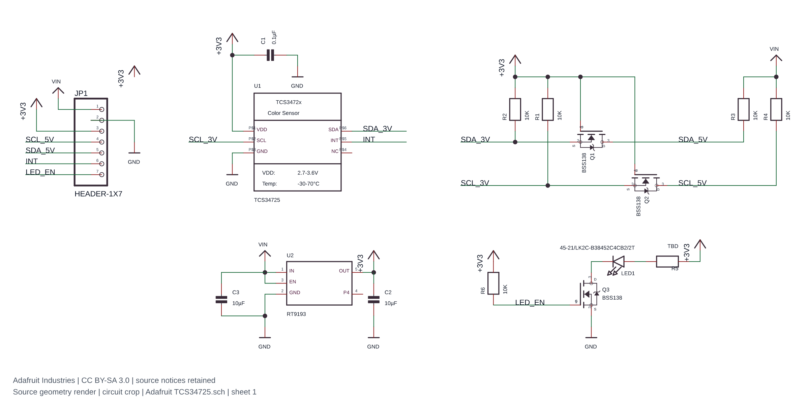

<details>
<summary>Complete system instruction and original first-turn evidence prompt</summary>

```text
You answer factual questions about the attached schematic and its extracted source evidence. Use only the supplied evidence. Identify connections as REFDES.PAD, where PAD is the physical package pad number. Distinguish schematic facts from design judgments. Do not invent missing components, specifications, measurements, or safety findings.
```

```text
Extracted native schematic evidence (not an electrical review):
{"scope": "this sheet only; physical package pad numbers, not symbol pin labels", "bom": [{"refdes": "C1", "value": "0.1\u00b5F"}, {"refdes": "C2", "value": "10\u00b5F"}, {"refdes": "C3", "value": "10\u00b5F"}, {"refdes": "FID1", "value": ""}, {"refdes": "FID2", "value": ""}, {"refdes": "JP1", "value": ""}, {"refdes": "LED1", "value": "45-21/LK2C-B38452C4CB2/2T"}, {"refdes": "Q1", "value": "BSS138"}, {"refdes": "Q2", "value": "BSS138"}, {"refdes": "Q3", "value": "BSS138"}, {"refdes": "R1", "value": "10K"}, {"refdes": "R2", "value": "10K"}, {"refdes": "R3", "value": "10K"}, {"refdes": "R4", "value": "10K"}, {"refdes": "R5", "value": "TBD"}, {"refdes": "R6", "value": "10K"}, {"refdes": "U$14", "value": ""}, {"refdes": "U$8", "value": ""}, {"refdes": "U1", "value": "TCS34725"}, {"refdes": "U2", "value": "RT9193"}], "nets": {"+3V3": ["C1.1", "C2.1", "JP1.3", "Q1.1", "Q2.1", "R1.2", "R2.2", "R5.1", "R6.2", "U1.P$1", "U2.5"], "GND": ["C1.2", "C2.2", "C3.2", "JP1.2", "Q3.2", "U1.P$3", "U2.2"], "INT": ["JP1.6", "U1.P$5"], "LED_EN": ["JP1.7", "Q3.1", "R6.1"], "N$1": ["LED1.K", "Q3.3"], "N$2": ["LED1.A", "R5.2"], "SCL_3V": ["Q2.2", "R1.1", "U1.P$2"], "SCL_5V": ["JP1.4", "Q2.3", "R4.1"], "SDA_3V": ["Q1.2", "R2.1", "U1.P$6"], "SDA_5V": ["JP1.5", "Q1.3", "R3.1"], "VIN": ["C3.1", "JP1.1", "R3.2", "R4.2", "U2.1", "U2.3"]}}

What value is recorded for R1?
```

</details>

**User 1**

```text
What value is recorded for R1?
```

**Assistant 1 — simulated gold**

```text
R1 has value 10K in the source schematic.
```

**User 2**

```text
Which physical component pads connect to net INT on this sheet?
```

**Assistant 2 — simulated gold**

```text
On this sheet, INT connects JP1.6, U1.P$5.
```

**User 3**

```text
Trace JP1.6: which other physical pads share its net on this sheet?
```

**Assistant 3 — simulated gold**

```text
JP1.6 is on INT, together with U1.P$5.
```

**User 4**

```text
What is the specified value of R2?
```

**Assistant 4 — simulated gold**

```text
R2 has value 10K in the source schematic.
```

**User 5**

```text
What value is R9999, and what does it connect to?
```

**Assistant 5 — simulated gold**

```text
There is no R9999 in the supplied sheet evidence. Its value and connections are not shown.
```

**User 6**

```text
What measured voltage was observed at JP1.6 during a powered bench test?
```

**Assistant 6 — simulated gold**

```text
No bench measurement is supplied in this schematic or source evidence. I cannot infer a measured voltage.
```
